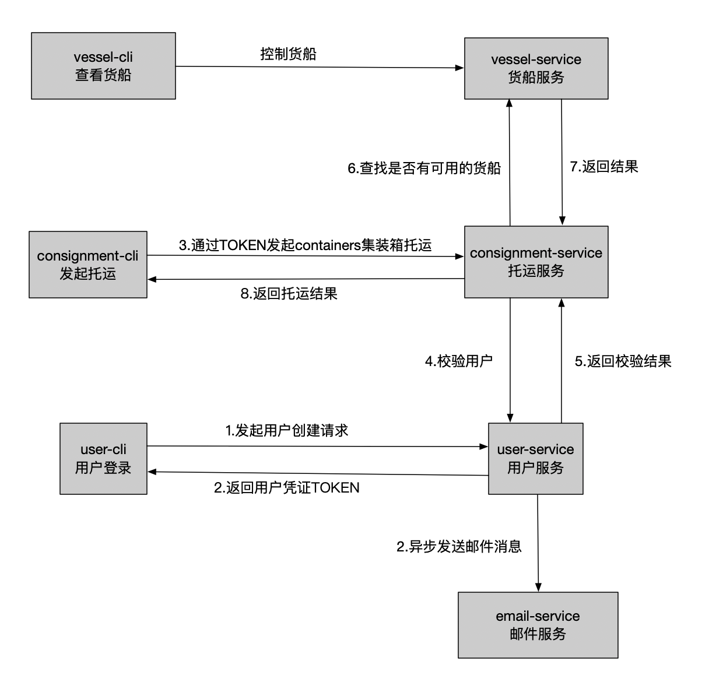

## go-micro微服务学习-货运系统
因为众所周知的原因，一直在探寻Golang在业务上的锲合度，所以花了一定的时间简单的搭建
了两个适合自己业务的模板（参见参考1、参考2），这两个模板分别采用了
[iris](http://github.com/kataras/iris)框架和
[gin](http://github.com/gin-gonic/gin)框架，两个模板都包含了平滑关闭、
database连接池和redis连接池、GRPC调用（欢迎食用，如果有其他意见也欢迎request）。
在此过程中，偶然看到了一篇关于go-micro教程（参考3），觉得十分有趣，并且一步步的
实践完成，在此记录一下整个过程，如果有小伙伴对这个go-micro感兴趣，对微服务感兴趣，
可以参考一下下，希望可以帮助到各位。(PS:我在社区看到有人翻译成中文了，感兴趣也可以看译文。)

## 示意图

整个微服务的示意图如下：

使用到的技术栈：
Docker、MongoDB、go-micro、grpc、protobuf、NATS、JWT、Postgres、Kubernetes...

注意：
完整代码见github仓库，文章中的代码只会例举一些关键性的改动，方便阅读。

## 目录

* 0.1 基本的grpc
* 0.2 添加GetConsignments方法
* 0.3 引入docker
* 0.4 从grpc到go-micro
* 0.5 增加货船服务
* 0.6 引入docker-compose编排
* 0.7 引入MongoDB
* 0.8 引入user服务和Postgres
* 0.9 引入jwt鉴权
* 1.0 引入Pubsub订阅
* 1.1 从Pubsub订阅到NATS
* 1.2 开启web端交互
* 1.3 开启api端交互

## 参考
1. [https://github.com/Birjemin/gin-structure](https://github.com/Birjemin/gin-structure)
2. [https://github.com/Birjemin/iris-structure](https://github.com/Birjemin/iris-structure)
3. [https://ewanvalentine.io/microservices-in-golang-part-1/](https://ewanvalentine.io/microservices-in-golang-part-1/)