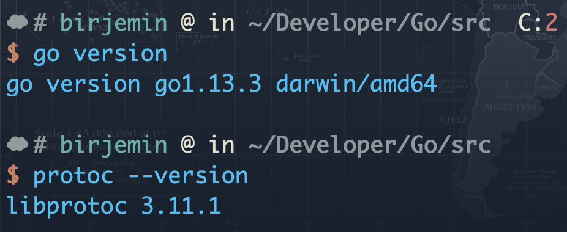
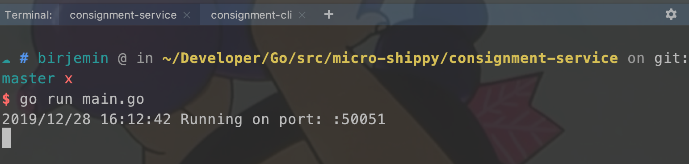
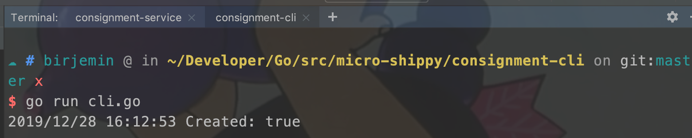

## 第一部分：基本的gRPC

### 准备工作

- 安装Golang、protobuf：
```
brew install protobuf
```
- 验证版本信息：


- 什么是[gRPC](http://birjemin.com/wiki/tech-grpc)
- 什么是[protobuf](https://developers.google.com/protocol-buffers/docs/overview)？

### 开始

#### 初始化项目

根据自己的需要初始化项目，比如：

``` 
mkdir micro-shippy
cd micro-shippy
go mod init github.com/birjemin/micro-shippy
```

#### 建立consignment-service服务
`consignment-service`是托运服务，主要的功能是发起托运的动作，在后期的教程中，扮演的角色是发起托运，并在此过程中调用用户服务进行鉴权、调用货船服务获取货船信息。在这一节内容中，只是实现一下grpc调用，方便学习grpc的使用。

##### 目录结构：
```
$GOPATH/src
    └── micro-shippy
        └── consignment-service
            ├── Makefile
            ├── main.go
            └── proto
                └── consignment
                    └── consignment.proto
```

##### 定义protobuf通信协议
在consignment.proto写入下面内容：
```
    syntax = "proto3";

    package consignment;

    // 货轮服务
    service ShippingService {
        // 托运货物
        rpc CreateConsignment(Consignment) returns (Response) {}
    }
    // 货物属性（id、描述、重量、包含的集装箱、货船id）
    message Consignment {
        string id = 1;
        string description = 2;
        int32 weight = 3;
        repeated Container containers = 4;
        string vessel_id = 5;
    }
    // 单个集装箱（id、客户id、来源、用户id）
    message Container {
        string id = 1;
        string customer_id = 2;
        string origin = 3;
        string user_id = 4;
    }
    // 托运结果（托运结果，托运货物）
    message Response {
        bool created = 1;
        Consignment consignment = 2;
    }
```

##### 生成协议代码
首先在Makefile文件中写入下面内容(请注意是tab，不是4个空格！！！)：

```
build:
	protoc -I. --go_out=plugins=grpc:. proto/consignment/consignment.proto
```

然后执行命令：

```sh
make build
```

结果（报错`Nothing to be done...`是因为我的IDE将tab转换成了4个空格，导致失败）：


如果执行成功，则会在consignment目录中会出现一个`consignment.pb.go`文件

##### 编写consignment-service服务
在main.go文件中写入下面内容：

```
package main

import (
    "context"
    "google.golang.org/grpc"
    "log"
    "net"
    "sync"
    pb "github.com/birjemin/micro-shippy/consignment-service/proto/consignment"
)

const (
    port = ":50051"
)

type repository interface {
    Create(*pb.Consignment) (*pb.Consignment, error)
}

type Repository struct {
    mu           sync.RWMutex
    consignments []*pb.Consignment
}

// repository 创建托运，这一节中直接返回提交的托运数据，不作任何其他处理
func (repo *Repository) Create(consignment *pb.Consignment) (*pb.Consignment, error) {
    repo.mu.Lock()
    updated := append(repo.consignments, consignment)
    repo.consignments = updated
    repo.mu.Unlock()
    return consignment, nil
}

type service struct {
    repo repository
}
// 创建一个托运服务
func (s *service) CreateConsignment(ctx context.Context, req *pb.Consignment) (*pb.Response, error) {
    // 创建托运
    consignment, err := s.repo.Create(req)
    if err != nil {
        return nil, err
    }
    // 返回托运结果
    return &pb.Response{Created: true, Consignment: consignment}, nil
}

func main() {

    repo := &Repository{}
    // 开启rpc服务
    lis, err := net.Listen("tcp", port)
    if err != nil {
        log.Fatalf("failed to listen: %v", err)
    }
    s := grpc.NewServer()
    // 注册托运服务
    pb.RegisterShippingServiceServer(s, &service{repo})

    log.Println("Running on port:", port)
    // 运行rpc服务
    if err := s.Serve(lis); err != nil {
        log.Fatalf("failed to serve: %v", err)
    }
}
```
##### 运行consignment-service服务
通过编写托运服务的代码，可以直接运行一个托运的rpc服务，接下来编写一个client终端，用于测试和校验所写的托运服务是否可以正常的工作。

#### 编写consignment-cli访问终端

##### 目录结构：

```
$GOPATH/src
    └── micro-shippy
        └── consignment-cli
            ├── cli.go
            └── consignment.json
```

##### 编写cli.go

```
func parseFile(file string) (*pb.Consignment, error) {
    ...
}

func main() {
    // 拨号
    conn, err := grpc.Dial(address, grpc.WithInsecure())
    if err != nil {
        log.Fatalf("Did not connect: %v", err)
    }
    defer conn.Close()
    // 获取rpc的client
    client := pb.NewShippingServiceClient(conn)

    // 这段代码可以忽略
    file := defaultFilename
    if len(os.Args) > 1 {
        file = os.Args[1]
    }

    consignment, err := parseFile(file)
    if err != nil {
        log.Fatalf("Could not parse file: %v", err)
    }
    // 调用托运服务CreateConsignment方法
    r, err := client.CreateConsignment(context.Background(), consignment)
    if err != nil {
        log.Fatalf("Could not greet: %v", err)
    }
    log.Printf("Created: %t", r.Created)
}
```

##### 编写consignment.json
这个是托运的详细数据，`cli.go`加载数据，然后调用托运服务的`CreateConsignment`方法。
```
{
  "description": "This is a test consignment",
  "weight": 550,
  "containers": [
    { "customer_id": "cust001", "user_id": "user001", "origin": "Manchester, United Kingdom" }
  ],
  "vessel_id": "vessel001"
}
```

#### 测试
分别在连个窗口执行下面命令（会自动拉取依赖），如果返回`true`，则说明托运服务成功，最基本的rpc调用实现啦！

```
go run main.go
```



```
go run cli.go
```


#### 当前的文件目录
```
$GOPATH/src
    └── micro-shippy
        ├── README.md
        ├── consignment-cli
        │   ├── cli.go
        │   └── consignment.json
        ├── consignment-service
        │   ├── Makefile
        │   ├── main.go
        │   └── proto
        │       └── consignment
        │           ├── consignment.pb.go
        │           └── consignment.proto
        ├── go.mod
        └── go.sum
```