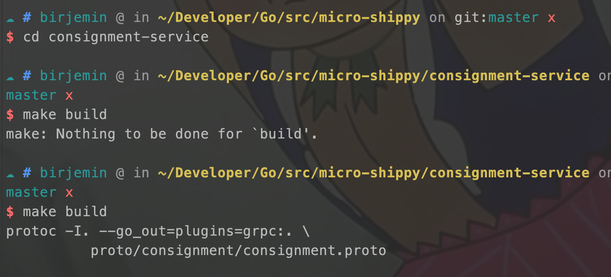

## 第一部分：基本的gRPC

### 准备工作
首先可以参考这篇文章对[gRPC](http://birjemin.com/wiki/tech-grpc)有一个简单的了解

安装Golang、protobuf：

```
brew install protobuf
```

验证版本信息：


### 开始

#### 初始化项目

根据自己的需要初始化项目：

``` 
mkdir micro-shippy
cd micro-shippy
go mod init github.com/birjemin/micro-shippy
```

#### 建立consignment-service服务
##### 目录结构：
```
$GOPATH/src
    └── micro-shippy
        └── consignment-service
            ├── Makefile
            ├── main.go
            └── proto
                └── consignment
                    └── consignment.proto
```

##### 定义protobuf通信协议
在consignment.proto写入下面内容：
```
syntax = "proto3";

package consignment;

// 货轮服务
service ShippingService {
    // 托运货物
    rpc CreateConsignment(Consignment) returns (Response) {}
}
// 货物属性（id、描述、重量、包含的集装箱、货船id）
message Consignment {
    string id = 1;
    string description = 2;
    int32 weight = 3;
    repeated Container containers = 4;
    string vessel_id = 5;
}
// 单个集装箱（id、客户id、来源、用户id）
message Container {
    string id = 1;
    string customer_id = 2;
    string origin = 3;
    string user_id = 4;
}
// 托运结果（托运结果，托运货物）
message Response {
    bool created = 1;
    Consignment consignment = 2;
}
```

##### 生成协议代码
在Makefile文件中写入下面内容(请注意是tab，不是4个空格！！！)：

```
build:
	protoc -I. --go_out=plugins=grpc:. \
	  proto/consignment/consignment.proto
```

执行命令：

```sh
make build
```

结果（报错`Nothing to be done...`是因为我的IDE将tab转换成了4个空格，导致失败）：


在consignment目录中会出现一个`consignment.pb.go`文件

##### 编写consignment-service服务
在main.go文件中写入下面内容：

```
...
type repository interface {
    Create(*pb.Consignment) (*pb.Consignment, error)
}

// Repository - Dummy repository, this simulates the use of a datastore
// of some kind. We'll replace this with a real implementation later on.
type Repository struct {
    mu           sync.RWMutex
    consignments []*pb.Consignment
}

// Create a new consignment
func (repo *Repository) Create(consignment *pb.Consignment) (*pb.Consignment, error) {
    ...
}

// Service should implement all of the methods to satisfy the service
// we defined in our protobuf definition. You can check the interface
// in the generated code itself for the exact method signatures etc
// to give you a better idea.
type service struct {
    repo repository
}

// CreateConsignment - we created just one method on our service,
// which is a create method, which takes a context and a request as an
// argument, these are handled by the gRPC server.
func (s *service) CreateConsignment(ctx context.Context, req *pb.Consignment) (*pb.Response, error) {
    ...
}

func main() {

    repo := &Repository{}

    // Set-up our gRPC server.
    lis, err := net.Listen("tcp", port)
    if err != nil {
        log.Fatalf("failed to listen: %v", err)
    }
    s := grpc.NewServer()

    // Register our service with the gRPC server, this will tie our
    // implementation into the auto-generated interface code for our
    // protobuf definition.
    pb.RegisterShippingServiceServer(s, &service{repo})

    log.Println("Running on port:", port)
    if err := s.Serve(lis); err != nil {
        log.Fatalf("failed to serve: %v", err)
    }
}

```

#### 编写consignment-cli访问终端
##### 目录结构：

```
$GOPATH/src
    └── micro-shippy
        └── consignment-cli
            ├── cli.go
            └── consignment.json
```

##### 编写cli.go

```
func parseFile(file string) (*pb.Consignment, error) {
    ...
}

func main() {
    // Set up a connection to the server.
    conn, err := grpc.Dial(address, grpc.WithInsecure())
    if err != nil {
        log.Fatalf("Did not connect: %v", err)
    }
    defer conn.Close()
    client := pb.NewShippingServiceClient(conn)

    // Contact the server and print out its response.
    file := defaultFilename
    if len(os.Args) > 1 {
        file = os.Args[1]
    }

    consignment, err := parseFile(file)

    if err != nil {
        log.Fatalf("Could not parse file: %v", err)
    }

    r, err := client.CreateConsignment(context.Background(), consignment)
    if err != nil {
        log.Fatalf("Could not greet: %v", err)
    }
    log.Printf("Created: %t", r.Created)
}

```

##### 编写consignment.json
```
{
  "description": "This is a test consignment",
  "weight": 550,
  "containers": [
    { "customer_id": "cust001", "user_id": "user001", "origin": "Manchester, United Kingdom" }
  ],
  "vessel_id": "vessel001"
}
```

#### 测试
分别在连个窗口执行下面命令（会自动拉取依赖）

```
go run main.go
```


```
go run cli.go
```


#### 当前的文件目录
```
$GOPATH/src
    └── micro-shippy
        ├── README.md
        ├── consignment-cli
        │   ├── cli.go
        │   └── consignment.json
        ├── consignment-service
        │   ├── Makefile
        │   ├── main.go
        │   └── proto
        │       └── consignment
        │           ├── consignment.pb.go
        │           └── consignment.proto
        ├── go.mod
        └── go.sum
```