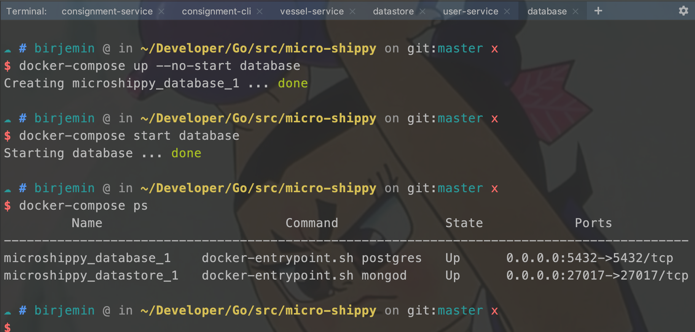

# 第十节：引入Pubsub订阅

## 准备工作
- 什么是Pubsub订阅？
- 如何使用go micro自带的Pubsub订阅？

## 开始
这一节引入邮件服务，当用户服务创建一个用户时，通过Pubsub订阅的方式广播出去，邮件服务收到广播做出相应的动作。

### user-service服务
注册Publisher组件，并且触发广播

#### 修改handler.go
触发广播。

```
...
type service struct {
    repo         Repository
    tokenService Authable
    Publisher    micro.Publisher
}
...
func (srv *service) Create(ctx context.Context, req *pb.User, res *pb.Response) error {
    ...
    // 广播 publisher handle
    if err := srv.Publisher.Publish(ctx, req); err != nil {
        return err
    }
    return nil
}
...
```

#### main.go文件
注册Publisher广播。

```
...
    publisher := micro.NewPublisher("user.created", srv.Client())
    // 注册服务
    pb.RegisterUserServiceHandler(srv.Server(), &service{repo, tokenService, publisher})
...
```

### 增加email-service服务
新增一个邮件服务，邮件服务实质上就是订阅广播，处理触发的事件。

#### 增加main.go文件
```
package main

import (
    "context"
    pb "github.com/birjemin/micro-shippy/user-service/proto/user"
    "github.com/micro/go-micro"
    "log"
)

const topic = "user.created"

type Subscriber struct{}

func (sub *Subscriber) Process(ctx context.Context, user *pb.User) error {
    log.Println("Picked up a new message")
    log.Println("Sending email to:", user.Name)
    return nil
}

func main() {
    srv := micro.NewService(
        micro.Name("go.micro.srv.email"),
        micro.Version("latest"),
    )

    srv.Init()

    _ = micro.RegisterSubscriber(topic, srv.Server(), new(Subscriber))

    // Run the server
    if err := srv.Run(); err != nil {
        log.Println(err)
    }
}
```

### 修改docker-compose.yml

```
version: '3.1'
...
  email-service:
    build: ./email-service
...
```

### 测试

database窗口
```
docker-compose up --no-start database
docker-compose start database 
docker-compose ps
```


user-service开启：

```
make build
docker-compose build --no-cache user-service 
docker-compose run user-service 
```


email-service开启：

```
make build
docker-compose build --no-cache email-service 
docker-compose run email-service 
```


user-cli开启：

```
docker-compose run user-cli 
```


user-service窗口变化：


email-service窗口变化：


### 当前的文件目录
```
$GOPATH/src
    └── micro-shippy
        ├── README.md
        ├── consignment-cli
        │   ├── Dockerfile
        │   ├── Makefile
        │   ├── cli.go
        │   ├── consignment-cli
        │   └── consignment.json
        ├── consignment-service
        │   ├── Dockerfile
        │   ├── Makefile
        │   ├── consignment-service
        │   ├── datastore.go
        │   ├── handler.go
        │   ├── main.go
        │   ├── proto
        │   │   └── consignment
        │   │       ├── consignment.pb.go
        │   │       └── consignment.proto
        │   └── repository.go
        ├── docker-compose.yml
        ├── email-service
        │   ├── Dockerfile
        │   ├── Makefile
        │   ├── email-service
        │   └── main.go
        ├── go.mod
        ├── go.sum
        ├── user-cli
        │   ├── Dockerfile
        │   ├── Makefile
        │   ├── cli.go
        │   └── user-cli
        ├── user-service
        │   ├── Dockerfile
        │   ├── Makefile
        │   ├── database.go
        │   ├── handler.go
        │   ├── main.go
        │   ├── proto
        │   │   └── user
        │   │       ├── extension.go
        │   │       ├── user.pb.go
        │   │       └── user.proto
        │   ├── repository.go
        │   ├── token_service.go
        │   └── user-service
        └── vessel-service
            ├── Dockerfile
            ├── Makefile
            ├── datastore.go
            ├── handler.go
            ├── main.go
            ├── proto
            │   └── vessel
            │       ├── vessel.pb.go
            │       └── vessel.proto
            ├── repository.go
            └── vessel-service


```