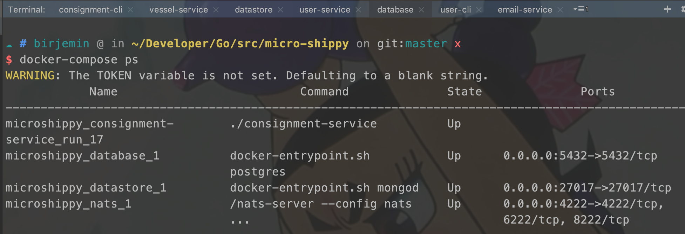
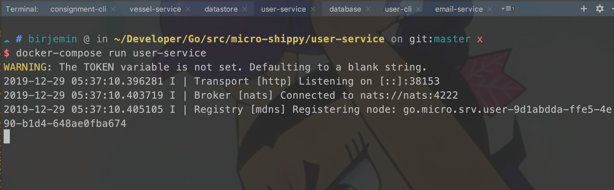
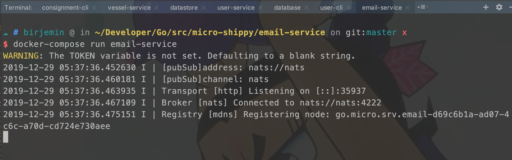
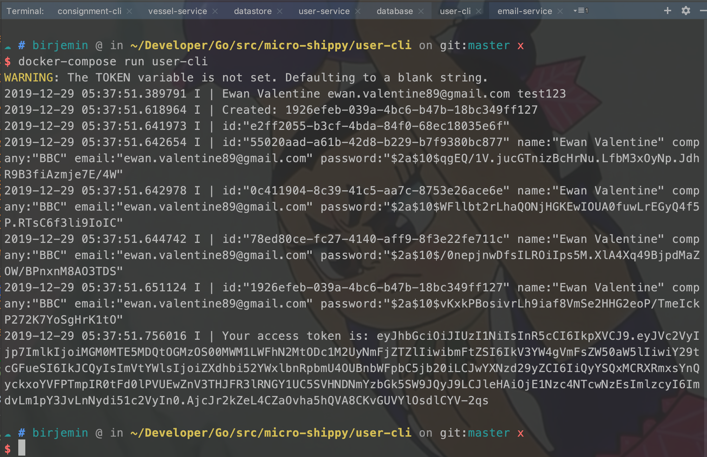
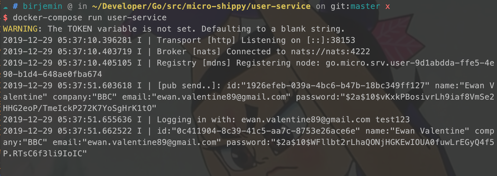
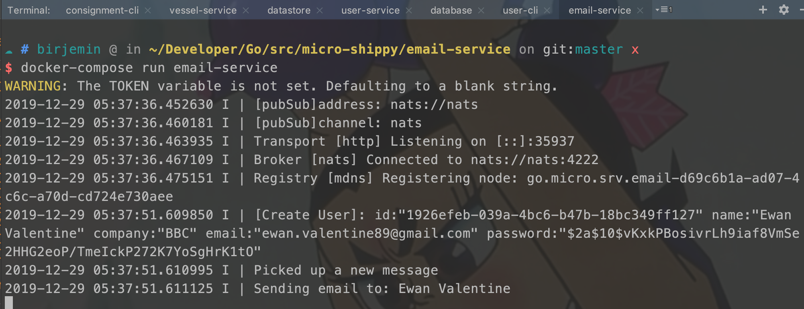

## 第十一部分：从Pubsub订阅到NATS

### 开始

#### user-service服务

##### 修改handler.go
```
...
type service struct {
    repo         Repository
    tokenService Authable
    Publisher    broker.Broker
}
...
func (srv *service) Create(ctx context.Context, req *pb.User, res *pb.Response) error {
    ...
    // 发布带有用户所有信息的消息
    if err := srv.publishEvent(req); err != nil {
        return err
    }
    return nil
}

func (srv *service) publishEvent(user *pb.User) error {
    body, err := json.Marshal(user)
    if err != nil {
        return err
    }

    msg := &broker.Message{
        Header: map[string]string{
            "id": user.Id,
        },
        Body: body,
    }
    log.Printf("[pub send..]: %v\n", user)

    // send user.created topic message
    if err := srv.Publisher.Publish(topic, msg); err != nil {
        log.Fatalf("[pub] failed: %v\n", err)
    }
    return nil
}
...
```

##### main.go文件
```
...
    // Register handler
    publisher := srv.Server().Options().Broker
    pb.RegisterUserServiceHandler(srv.Server(), &service{repo, tokenService, publisher})
...
```

#### 修改email-service服务
##### 修改main.go
```
...
func senEmail(user *pb.User) error {
    log.Println("Picked up a new message")
    log.Println("Sending email to:", user.Name)
    return nil
}

func main() {
    srv := micro.NewService(
        micro.Name("go.micro.srv.email"),
        micro.Version("latest"),
    )

    srv.Init()

    pubSub := srv.Server().Options().Broker

    log.Printf("[pubSub]address: %s\n", pubSub.Address())

    if err := pubSub.Connect(); err != nil {
        log.Fatalf("[pubSub]connect broker connect error: %v\n", err)
    }

    log.Printf("[pubSub]channel: %s\n", pubSub.String())

    _, err := pubSub.Subscribe(topic, func(pub broker.Event) error {
        var user *pb.User
        if err := json.Unmarshal(pub.Message().Body, &user); err != nil {
            return err
        }
        log.Printf("[Create User]: %v\n", user)
        go senEmail(user)
        return nil
    })

    if err != nil {
        log.Printf("sub error: %v\n", err)
    }

    // Run the server
    if err := srv.Run(); err != nil {
        log.Println(err)
    }
}
```

#### 修改docker-compose.yml

```
version: '3.1'
...

  user-service:
    build: ./user-service
    environment:
      DB_NAME: "postgres"
      DB_HOST: "database"
      DB_PORT: "5432"
      DB_USER: "postgres"
      DB_PASSWORD: "postgres"
      MICRO_BROKER: "nats"
      MICRO_BROKER_ADDRESS: "nats"

  email-service:
    build: ./email-service
    environment:
      MICRO_BROKER: "nats"
      MICRO_BROKER_ADDRESS: "nats"

  nats:
    image: nats
    ports:
      - 4222:4222
...
```

#### 测试

database窗口
```
docker-compose up --no-start nats
docker-compose start nats 
docker-compose ps
```


user-service开启：

```
make build
docker-compose build --no-cache user-service 
docker-compose run user-service 
```


email-service开启：

```
make build
docker-compose build --no-cache email-service 
docker-compose run email-service 
```


user-cli开启：

```
docker-compose run user-cli 
```


user-service窗口变化：


email-service窗口变化：


#### 当前的文件目录
```
$GOPATH/src
    └── micro-shippy
        ├── README.md
        ├── consignment-cli
        │   ├── Dockerfile
        │   ├── Makefile
        │   ├── cli.go
        │   ├── consignment-cli
        │   └── consignment.json
        ├── consignment-service
        │   ├── Dockerfile
        │   ├── Makefile
        │   ├── consignment-service
        │   ├── datastore.go
        │   ├── handler.go
        │   ├── main.go
        │   ├── proto
        │   │   └── consignment
        │   │       ├── consignment.pb.go
        │   │       └── consignment.proto
        │   └── repository.go
        ├── docker-compose.yml
        ├── email-service
        │   ├── Dockerfile
        │   ├── Makefile
        │   ├── email-service
        │   └── main.go
        ├── go.mod
        ├── go.sum
        ├── user-cli
        │   ├── Dockerfile
        │   ├── Makefile
        │   ├── cli.go
        │   └── user-cli
        ├── user-service
        │   ├── Dockerfile
        │   ├── Makefile
        │   ├── database.go
        │   ├── handler.go
        │   ├── main.go
        │   ├── proto
        │   │   └── user
        │   │       ├── extension.go
        │   │       ├── user.pb.go
        │   │       └── user.proto
        │   ├── repository.go
        │   ├── token_service.go
        │   └── user-service
        └── vessel-service
            ├── Dockerfile
            ├── Makefile
            ├── datastore.go
            ├── handler.go
            ├── main.go
            ├── proto
            │   └── vessel
            │       ├── vessel.pb.go
            │       └── vessel.proto
            ├── repository.go
            └── vessel-service


```