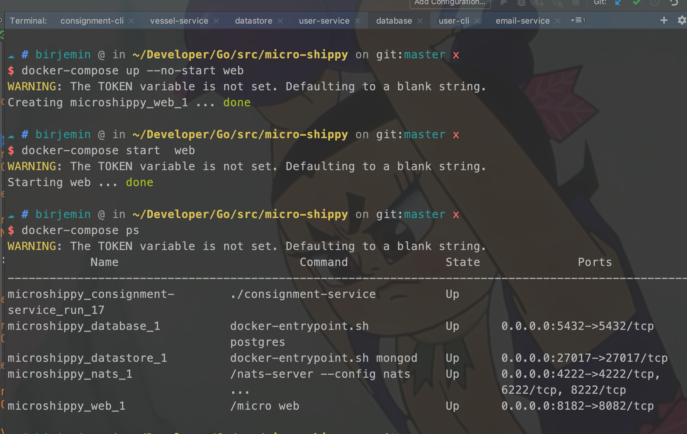
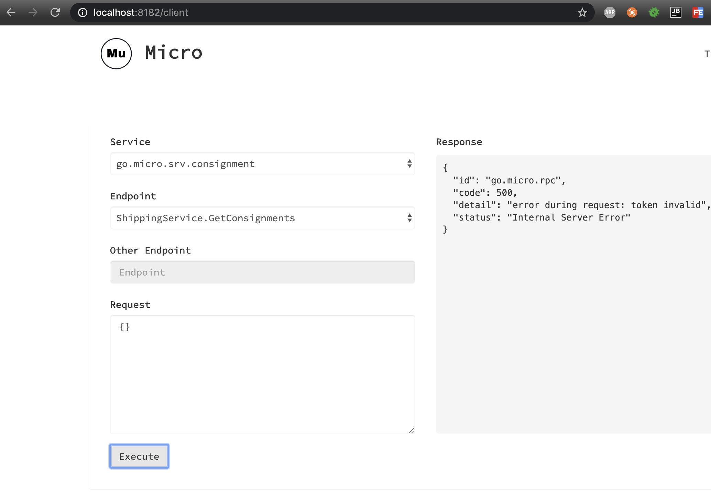
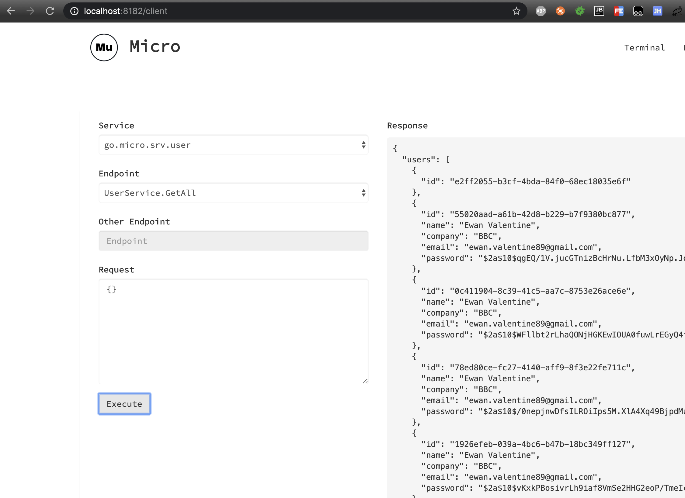
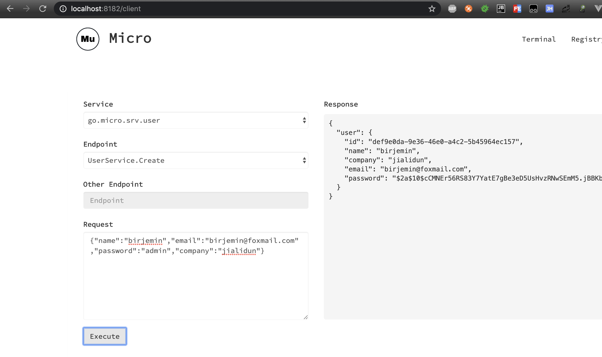
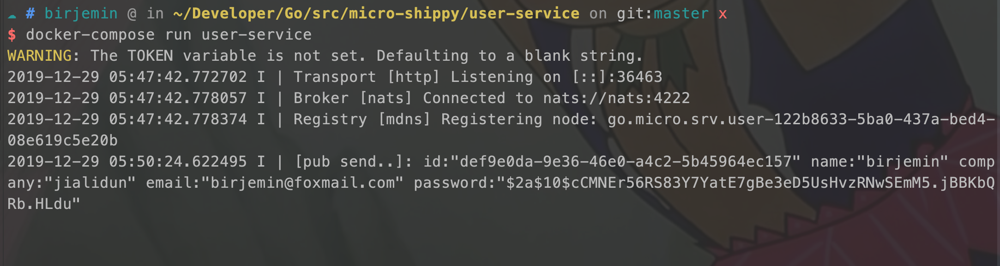
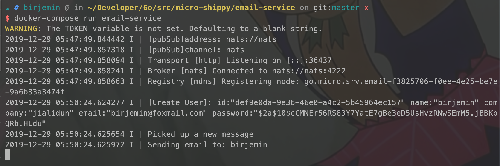
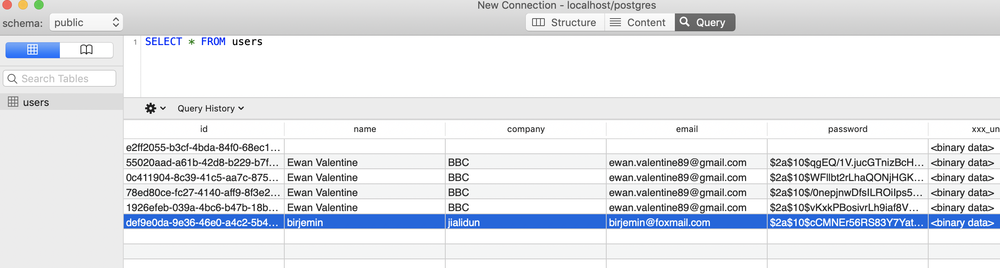

## 第十二部分：开启web端交互

### 开始

#### 修改docker-compose.yml

```
version: '3.1'
...
    web:
      command: web
      image: micro/micro:latest
      ports:
        - "8182:8082"
      environment:
        MICRO_ADDRESS: ":8082"
...
```

#### 测试

database窗口，开启web服务
```
docker-compose up --no-start web
docker-compose start web 
docker-compose ps
```


访问localhost:8182开启：






user-service窗口变化：


email-service窗口变化：


数据库数据变化：
