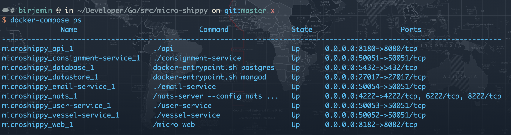
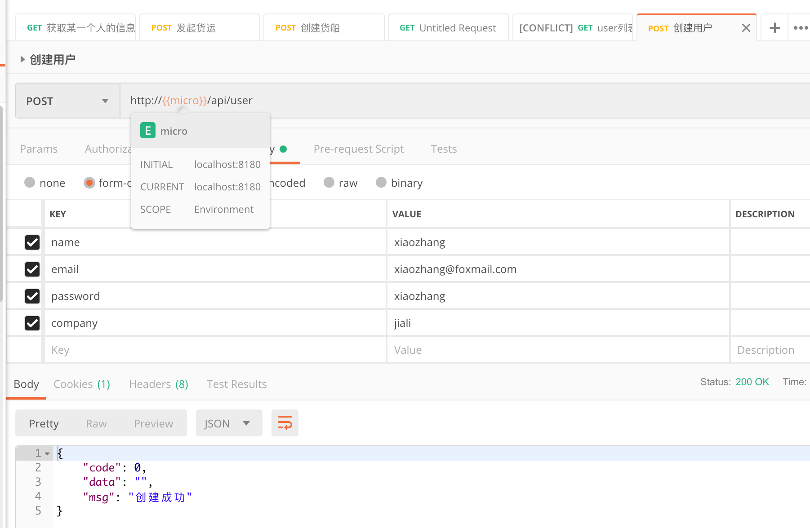
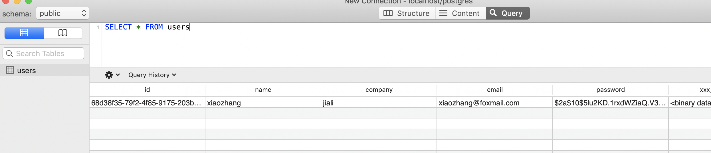
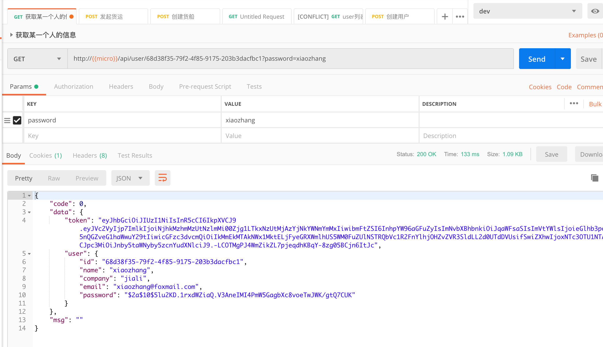
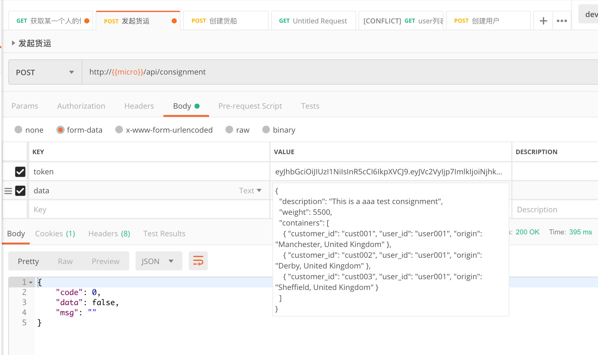
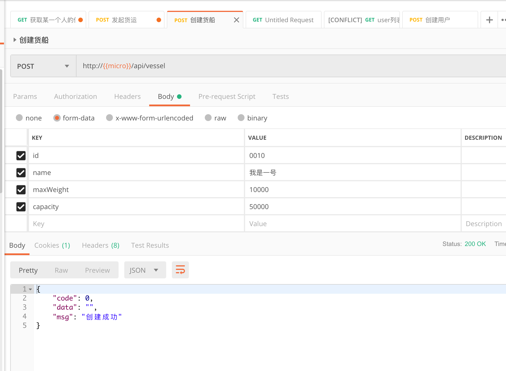
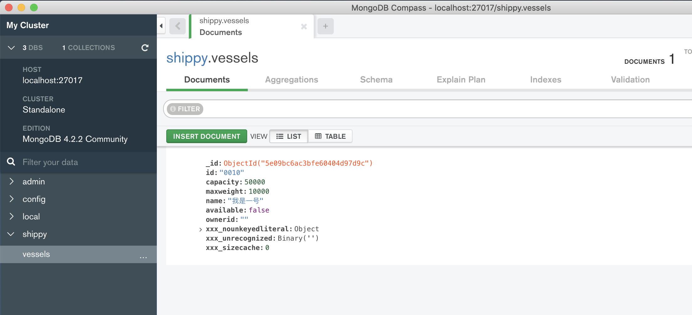
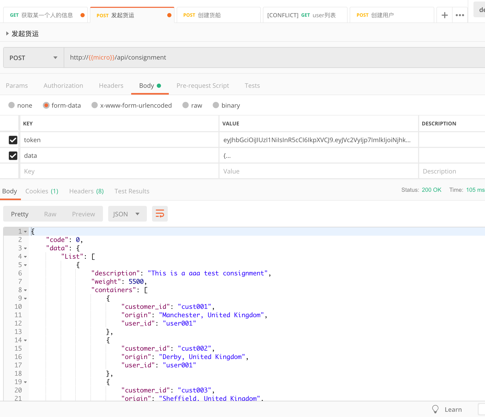

## 第十三部分：开启api网关

### 开始
```
go get github.com/gin-gonic/gin
```

#### 修改docker-compose.yml

```
...
  api:
    build: ./api
    ports:
      - "8180:8080"
    environment:
      MICRO_ADDRESS: ":8080"
...
```

#### 修改user-service服务
repository.go
```
...
func (repo *UserRepository) Get(id string) (*pb.User, error) {
    user := &pb.User{Id: id}
    if err := repo.db.First(&user).Error; err != nil {
        return nil, err
    }
    return user, nil
}
...
```

#### 修改vessel-service服务
main.go文件中注释掉createDummyData方法


#### 修改docker-compose.yml

#### 测试

database窗口，开启web服务
```
docker-compose up
docker-compose ps
```

1. 创建用户

2. 查看Postgres看users表单数据

3. 获取用户信息和token信息

4. 发起货运请求（没有货船~所以失败啦）

5. 创建货船

6. 查看MongoDB中的数据

7. 发起货运请求

