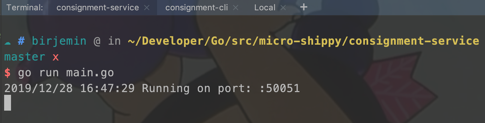
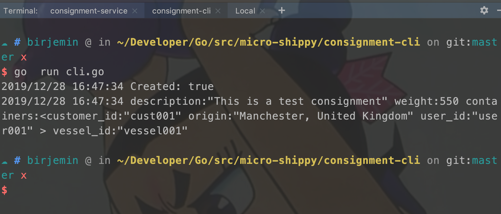

## 第二节：添加GetConsignments方法

### 开始
上一节中，托运服务只有一个创建托运的方法，这一节中给托运服务添加一个获取当前托运列表的方法，用于查看当前的托运详情。

#### 修改consignment-service服务

##### 修改protobuf通信协议
在`consignment.proto`中添加`GetConsignments`方法：
```
syntax = "proto3";

package consignment;

// 货轮服务
service ShippingService {
    // 托运货物
    rpc CreateConsignment(Consignment) returns (Response) {}
    // 添加查看托运货物方法
    rpc GetConsignments(GetRequest) returns (Response) {}
}
// 货物属性（id、描述、重量、包含的集装箱、货船id）
message Consignment {
    string id = 1;
    string description = 2;
    int32 weight = 3;
    repeated Container containers = 4;
    string vessel_id = 5;
}
// 单个集装箱（id、客户id、来源、用户id）
message Container {
    string id = 1;
    string customer_id = 2;
    string origin = 3;
    string user_id = 4;
}

// 查询请求
message GetRequest {}

// 托运结果（托运结果，托运货物，目前托运的货物）
message Response {
    bool created = 1;
    Consignment consignment = 2;
    repeated Consignment consignments = 3;
}
```

##### 重新生成协议代码

执行命令：

```sh
make build
```
在consignment目录中会重新生成`consignment.pb.go`文件

##### 修改consignment-service服务

在main.go文件中新增GetAll方法：

```
...
type repository interface {
    Create(*pb.Consignment) (*pb.Consignment, error)
    // 新增GetAll方法
    GetAll() []*pb.Consignment
}

type Repository struct {
    mu           sync.RWMutex
    consignments []*pb.Consignment
}

func (repo *Repository) Create(consignment *pb.Consignment) (*pb.Consignment, error) {
    ...
}

// repository 获取托运数据，这一节中直接返回提交的托运数据，不作任何其他处理
func (repo *Repository) GetAll() []*pb.Consignment {
    return repo.consignments
}

type service struct {
    repo repository
}

func (s *service) CreateConsignment(ctx context.Context, req *pb.Consignment) (*pb.Response, error) {
    ...
}

// 新增GetConsignments方法
func (s *service) GetConsignments(ctx context.Context, req *pb.GetRequest) (*pb.Response, error) {
    consignments := s.repo.GetAll()
    return &pb.Response{Consignments: consignments}, nil
}

func main() {
    ...
}
```

#### 修改consignment-cli访问终端

##### 修改cli.go

```
func parseFile(file string) (*pb.Consignment, error) {
    ...
}

func main() {
    // Set up a connection to the server.
    ...

    // 获取货运信息
    getAll, err := client.GetConsignments(context.Background(), &pb.GetRequest{})
    if err != nil {
        log.Fatalf("Could not list consignments: %v", err)
    }
    for _, v := range getAll.Consignments {
        log.Println(v)
    }
}

```

#### 测试
分别在连个窗口执行下面命令（会自动拉取依赖）

```
go run main.go
```



```
go run cli.go
```


#### 当前的文件目录
```
$GOPATH/src
    └── micro-shippy
        ├── README.md
        ├── consignment-cli
        │   ├── cli.go
        │   └── consignment.json
        ├── consignment-service
        │   ├── Makefile
        │   ├── main.go
        │   └── proto
        │       └── consignment
        │           ├── consignment.pb.go
        │           └── consignment.proto
        ├── go.mod
        └── go.sum
```