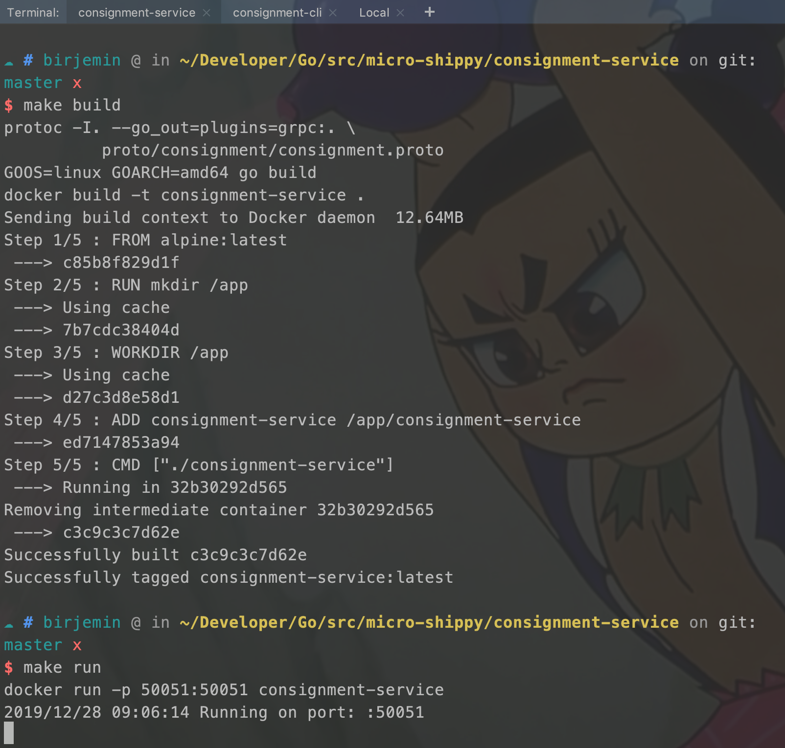
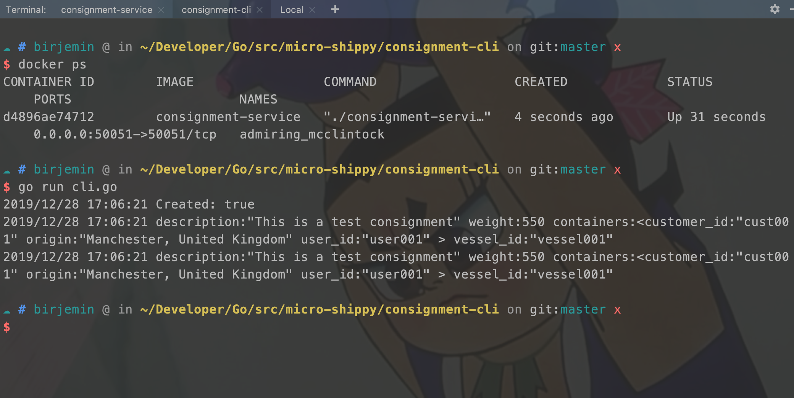

## 第三节：引入docker部署服务

### 准备工作
- 什么是[Docker](http://birjemin.com/wiki/docker)?
- Docker的基本使用姿势？

### 开始
引入docker部署

#### 修改consignment-service配置

##### 增加Dockerfile

```
FROM alpine:latest

RUN mkdir /app
WORKDIR /app
ADD consignment-service /app/consignment-service
# 运行服务
CMD ["./consignment-service"]
```

##### 修改Makefile
使用的插件是grpc

```
build:
	protoc -I. --go_out=plugins=grpc:. \
	  proto/consignment/consignment.proto
	GOOS=linux GOARCH=amd64 go build
	docker build -t consignment-service .
run:
	docker run -p 50051:50051 consignment-service
```

当`build`运行到`doker build`时会去查找当前目录下面的Dockerfile文件，进行docker构建。

#### 测试
分别在两个窗口执行下面命令（会自动拉取依赖）

```
// 构建
make build
// 运行
make run
```



```
go run cli.go
```


#### 当前的文件目录
```
$GOPATH/src
    └── micro-shippy
        ├── README.md
        ├── consignment-cli
        │   ├── cli.go
        │   └── consignment.json
        ├── consignment-service
        │   ├── Dockerfile
        │   ├── Makefile
        │   ├── main.go
        │   └── proto
        │       └── consignment
        │           ├── consignment.pb.go
        │           └── consignment.proto
        ├── go.mod
        └── go.sum
```