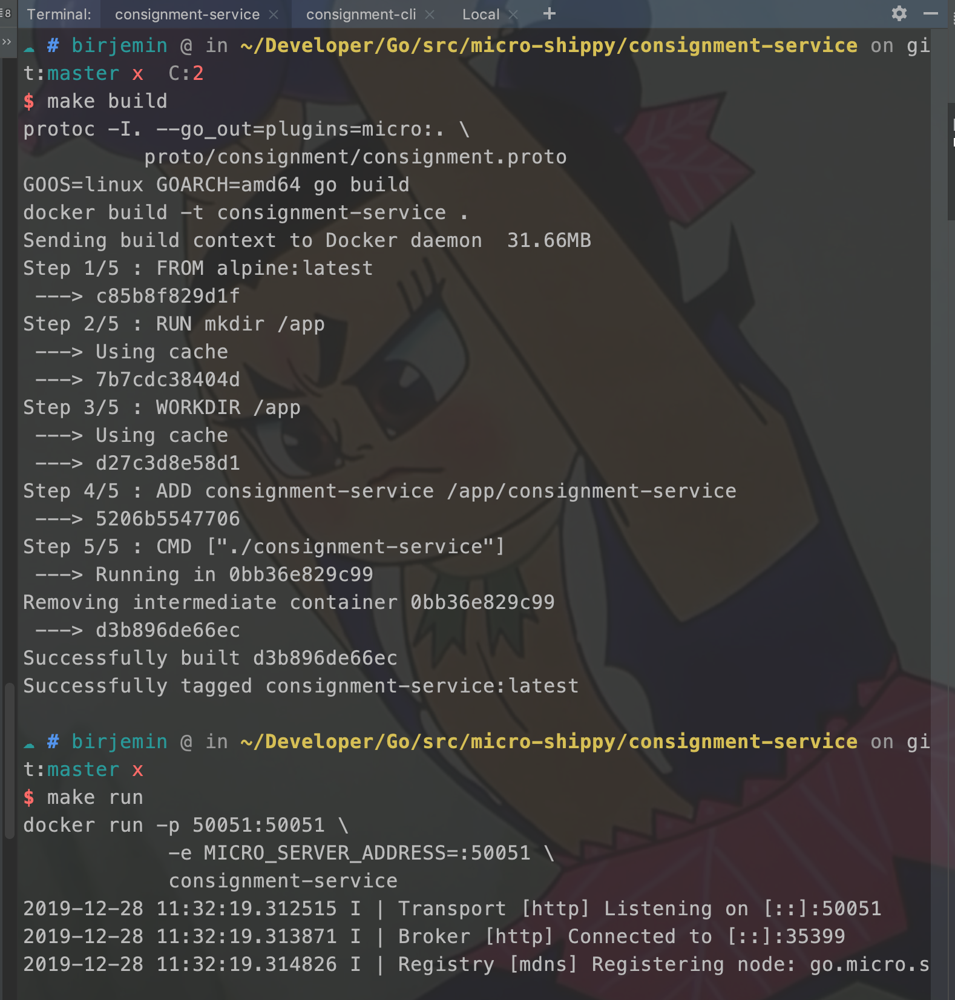

## 第四部分：从grpc到go-micro

### 开始

```
go get github.com/micro/go-micro
```

#### 修改consignment-service

##### 修改Makefile

```
build:
	protoc -I. --go_out=plugins=micro:. \
	  proto/consignment/consignment.proto
	GOOS=linux GOARCH=amd64 go build
	docker build -t consignment-service .
run:
	docker run -p 50051:50051 \
	    -e MICRO_SERVER_ADDRESS=:50051 \
	    consignment-service
```

##### 修改main.go中的代码

```
...

type repository interface {
    Create(*pb.Consignment) (*pb.Consignment, error)
    GetAll() []*pb.Consignment
}

// Repository - Dummy repository, this simulates the use of a datastore
// of some kind. We'll replace this with a real implementation later on.
type Repository struct {
    consignments []*pb.Consignment
}

func (repo *Repository) Create(consignment *pb.Consignment) (*pb.Consignment, error) {
    ...
}

func (repo *Repository) GetAll() []*pb.Consignment {
    return repo.consignments
}

// Service should implement all of the methods to satisfy the service
// we defined in our protobuf definition. You can check the interface
// in the generated code itself for the exact method signatures etc
// to give you a better idea.
type service struct {
    repo repository
}

// CreateConsignment - we created just one method on our service,
// which is a create method, which takes a context and a request as an
// argument, these are handled by the gRPC server.
func (s *service) CreateConsignment(ctx context.Context, req *pb.Consignment, res *pb.Response) error {
    ...
}

func (s *service) GetConsignments(ctx context.Context, req *pb.GetRequest, res *pb.Response) error {
    ...
}

func main() {

    repo := &Repository{}

    // Create a new service. Optionally include some options here.
    srv := micro.NewService(
        // This name must match the package name given in your protobuf definition
        micro.Name("go.micro.srv.consignment"),
    )

    // Init will parse the command line flags.
    srv.Init()

    // Register handler
    pb.RegisterShippingServiceHandler(srv.Server(), &service{repo})

    // Run the server
    if err := srv.Run(); err != nil {
        fmt.Println(err)
    }
}

```
#### 修改consignment-cli
##### 添加Makefile

```
build:
	GOOS=linux GOARCH=amd64 go build
	docker build -t consignment-cli .
run:
	docker run consignment-cli
```

##### 添加Dockerfile

```
FROM alpine:latest

RUN mkdir -p /app
WORKDIR /app

ADD consignment.json /app/consignment.json
ADD consignment-cli /app/consignment-cli

CMD ["./consignment-cli"]
```

##### 修改cli.go文件
```
...
func parseFile(file string) (*pb.Consignment, error) {
    ...
}

func main() {
    service := micro.NewService(micro.Name("go.micro.cli.consignment"))
    service.Init()

    client := pb.NewShippingServiceClient("go.micro.srv.consignment", service.Client())

    // Contact the server and print out its response.
    file := defaultFilename
    if len(os.Args) > 1 {
        file = os.Args[1]
    }

    consignment, err := parseFile(file)

    if err != nil {
        log.Fatalf("Could not parse file: %v", err)
    }

    r, err := client.CreateConsignment(context.Background(), consignment)
    if err != nil {
        log.Fatalf("Could not greet: %v", err)
    }
    log.Printf("Created: %t", r.Created)

    getAll, err := client.GetConsignments(context.Background(), &pb.GetRequest{})
    if err != nil {
        log.Fatalf("Could not list consignments: %v", err)
    }
    for _, v := range getAll.Consignments {
        log.Println(v)
    }
}

```

#### 测试
分别在两个窗口执行下面命令（会自动拉取依赖）

```
// 构建
make build
// 运行
make run
```




#### 当前的文件目录
```
$GOPATH/src
    └── micro-shippy
        ├── README.md
        ├── consignment-cli
        │   ├── Dockerfile
        │   ├── Makefile
        │   ├── cli.go
        │   ├── consignment-cli
        │   └── consignment.json
        ├── consignment-service
        │   ├── Dockerfile
        │   ├── Makefile
        │   ├── consignment-service
        │   ├── main.go
        │   └── proto
        │       └── consignment
        │           ├── consignment.pb.go
        │           └── consignment.proto
        ├── go.mod
        └── go.sum

```