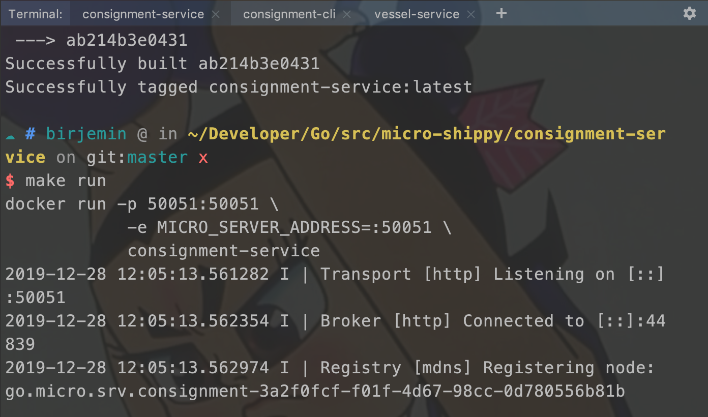
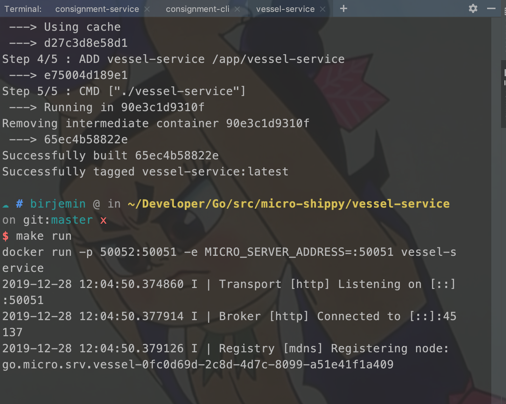
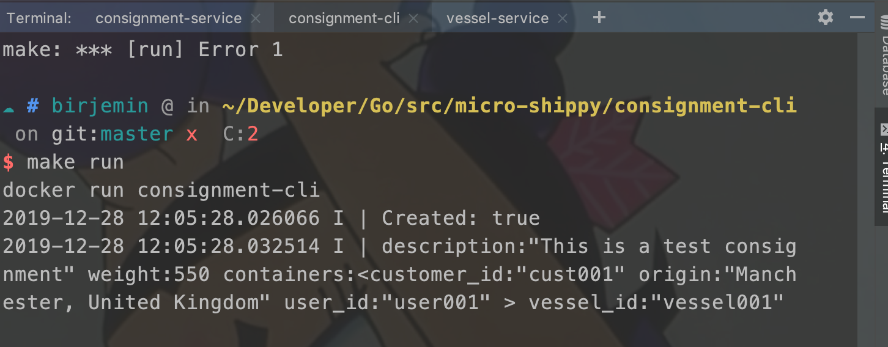
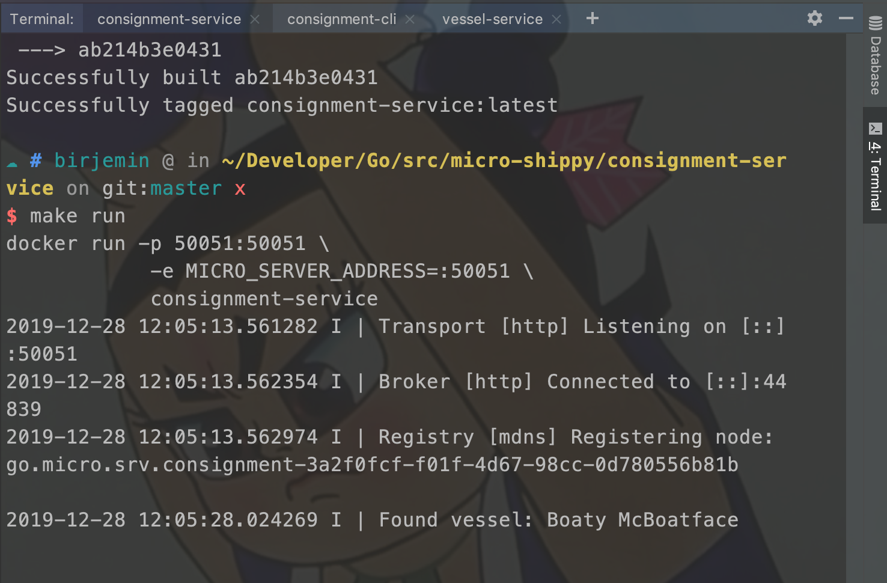

## 第五部分：引入货轮服务

### 开始

#### 增加vessel-service
##### 目录结构：
```
$GOPATH/src
    └── micro-shippy
        └── vessel-service
            ├── Dockerfile
            ├── Makefile
            ├── main.go
            └── proto
                └── vessel
                    └── vessel.proto
```
##### 增加protobuf通信协议
在vessel.proto修改成下面内容：
```
syntax = "proto3";

package vessel;

service VesselService {
    // 查找空闲的货轮
    rpc FindAvailable(Specification) returns (Response) {}
}

// 货轮属性（id、可装载集装箱数量、最大重量、名称、是否可用、归属）
message Vessel {
    string id = 1;
    int32 capacity = 2;
    int32 max_weight = 3;
    string name = 4;
    bool available = 5;
    string owner_id = 6;
}

// 待运送的货物规格（集装箱数量，最大重量）
message Specification {
    int32 capacity = 1;
    int32 max_weight = 2;
}

// 返回（返回货轮信息）
message Response {
    Vessel vessel = 1;
    repeated Vessel vessels = 2;
}
```

##### 生成协议代码

执行命令：

```sh
make build
```
在vessel目录中会重新生成`vessel.pb.go`文件

##### 增加Makefile
```
build:
	protoc -I. --go_out=plugins=micro:. \
	  proto/vessel/vessel.proto
	GOOS=linux GOARCH=amd64 go build
	docker build -t vessel-service .
run:
	docker run -p 50052:50051 -e MICRO_SERVER_ADDRESS=:50051 vessel-service
```

##### 增加Dockerfile
```
FROM alpine:latest

RUN mkdir /app
WORKDIR /app
ADD vessel-service /app/vessel-service

CMD ["./vessel-service"]
```

#### 修改consignment-service

##### 修改main.go中的代码

```
...

// Service should implement all of the methods to satisfy the service
// we defined in our protobuf definition. You can check the interface
// in the generated code itself for the exact method signatures etc
// to give you a better idea.
type service struct {
    repo repository
    // 增加vesselClient
    vesselClient vesselProto.VesselServiceClient
}

// CreateConsignment - we created just one method on our service,
// which is a create method, which takes a context and a request as an
// argument, these are handled by the gRPC server.
func (s *service) CreateConsignment(ctx context.Context, req *pb.Consignment, res *pb.Response) error {
    // add vessel
    vesselResponse, err := s.vesselClient.FindAvailable(context.Background(), &vesselProto.Specification{
        MaxWeight: req.Weight,
        Capacity: int32(len(req.Containers)),
    })
    log.Printf("Found vessel: %s \n", vesselResponse.Vessel.Name)
    if err != nil {
        return err
    }

    // We set the VesselId as the vessel we got back from our
    // vessel service
    req.VesselId = vesselResponse.Vessel.Id

    ...
}

func (s *service) GetConsignments(ctx context.Context, req *pb.GetRequest, res *pb.Response) error {
    ...
}

func main() {
    ...

    vesselClient := vesselProto.NewVesselServiceClient("go.micro.srv.vessel", srv.Client())

    // Register handlers
    pb.RegisterShippingServiceHandler(srv.Server(), &service{repo, vesselClient})

    // Run the server
    if err := srv.Run(); err != nil {
        fmt.Println(err)
    }
}

```
#### 修改consignment-cli
##### 修改consignment.json

```
{
  "description": "This is a test consignment",
  "weight": 55000,
  "containers": [
    { "customer_id": "cust001", "user_id": "user001", "origin": "Manchester, United Kingdom" },
    { "customer_id": "cust002", "user_id": "user001", "origin": "Derby, United Kingdom" },
    { "customer_id": "cust005", "user_id": "user001", "origin": "Sheffield, United Kingdom" }
  ]
}
```

#### 测试
分别在三个窗口执行下面命令（会自动拉取依赖）

```
// 构建
make build
// 运行
make run
```
consignment-service窗口：


vessel-service窗口：


consignment-cli窗口：


consignment-service窗口变化：


#### 当前的文件目录
```
$GOPATH/src
    └── micro-shippy
        ├── README.md
        ├── consignment-cli
        │   ├── Dockerfile
        │   ├── Makefile
        │   ├── cli.go
        │   ├── consignment-cli
        │   └── consignment.json
        ├── consignment-service
        │   ├── Dockerfile
        │   ├── Makefile
        │   ├── consignment-service
        │   ├── main.go
        │   └── proto
        │       └── consignment
        │           ├── consignment.pb.go
        │           └── consignment.proto
        ├── go.mod
        ├── go.sum
        └── vessel-service
            ├── Dockerfile
            ├── Makefile
            ├── main.go
            ├── proto
            │   └── vessel
            │       ├── vessel.pb.go
            │       └── vessel.proto
            └── vessel-service
```