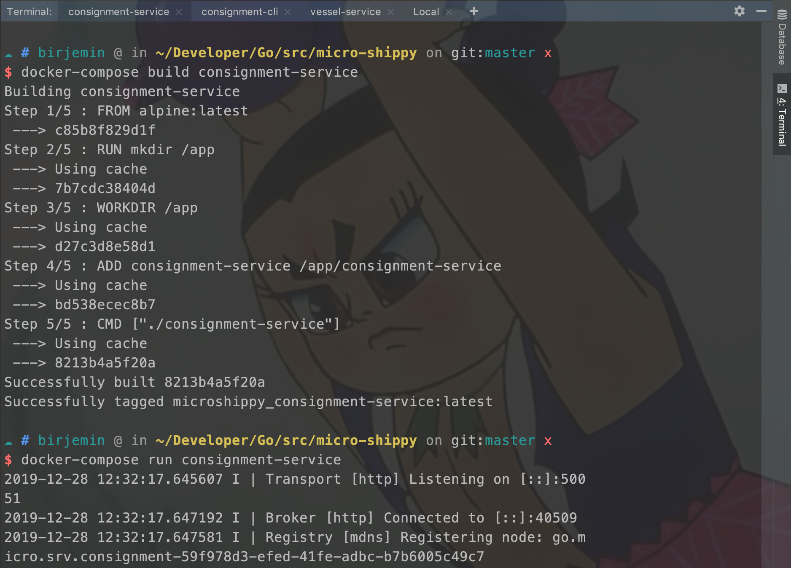
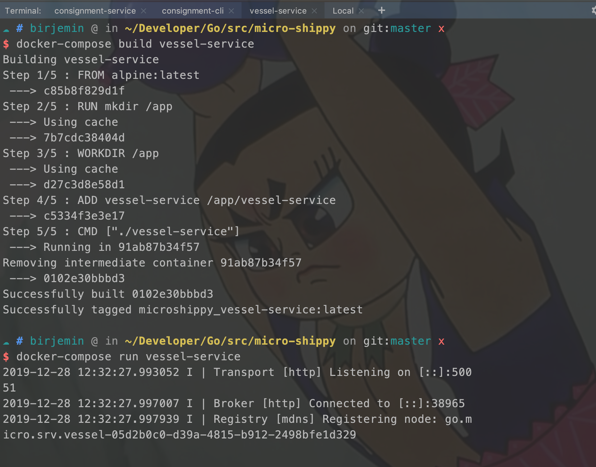
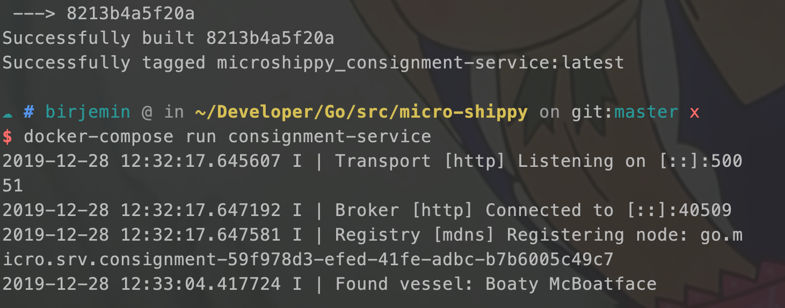

## 第六节：引入docker-compose编排

### 准备工作
- 什么是docker编排？
- docker编排的好处？

### 开始
增加docker编排，便于下一节引入MongoDB和Postgres数据库，因为下一节开始将使用docker镜像启动数据库，而不是本地安装数据库环境。

#### 增加docker-compose.yml文件
```
version: '3.1'

services:
  consignment-cli:
    build: ./consignment-cli

  consignment-service:
    build: ./consignment-service

  vessel-service:
    build: ./vessel-service
```
#### 测试
分别在三个窗口执行下面命令（会自动拉取依赖）

```
// 构建
docker-compose build xxx
// 运行
docker-compose run xxx
```
consignment-service窗口：


vessel-service窗口：


consignment-cli窗口：


consignment-service窗口变化：


#### 当前的文件目录
```
$GOPATH/src
    └── micro-shippy
        ├── README.md
        ├── consignment-cli
        │   ├── Dockerfile
        │   ├── Makefile
        │   ├── cli.go
        │   ├── consignment-cli
        │   └── consignment.json
        ├── consignment-service
        │   ├── Dockerfile
        │   ├── Makefile
        │   ├── consignment-service
        │   ├── main.go
        │   └── proto
        │       └── consignment
        │           ├── consignment.pb.go
        │           └── consignment.proto
        ├── docker-compose.yml
        ├── go.mod
        ├── go.sum
        └── vessel-service
            ├── Dockerfile
            ├── Makefile
            ├── main.go
            ├── proto
            │   └── vessel
            │       ├── vessel.pb.go
            │       └── vessel.proto
            └── vessel-service
```