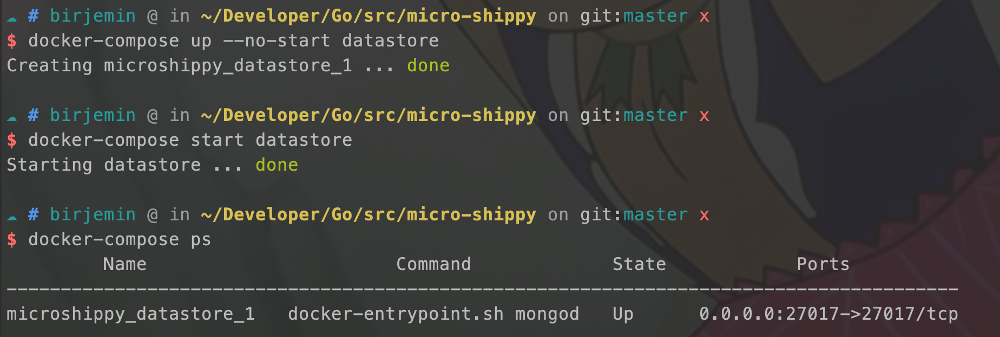
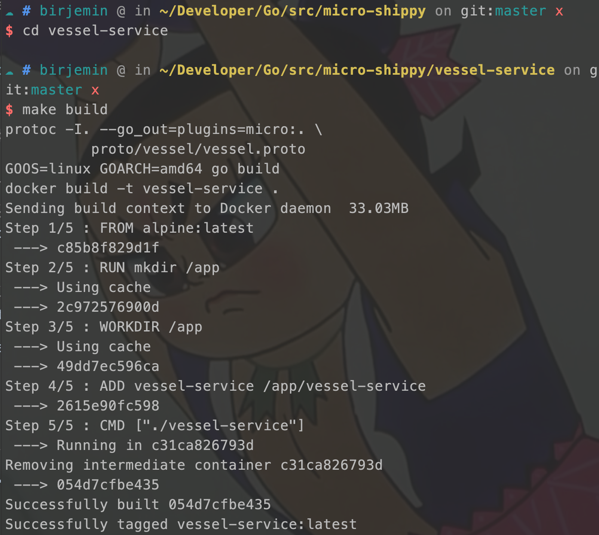
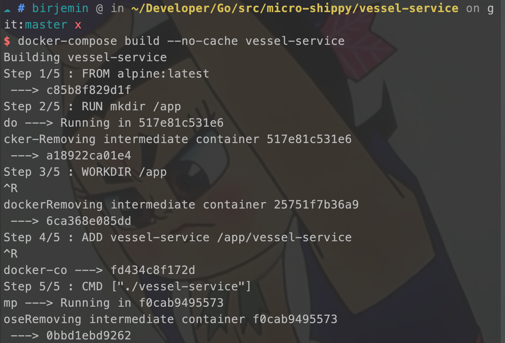
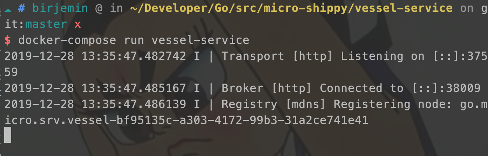
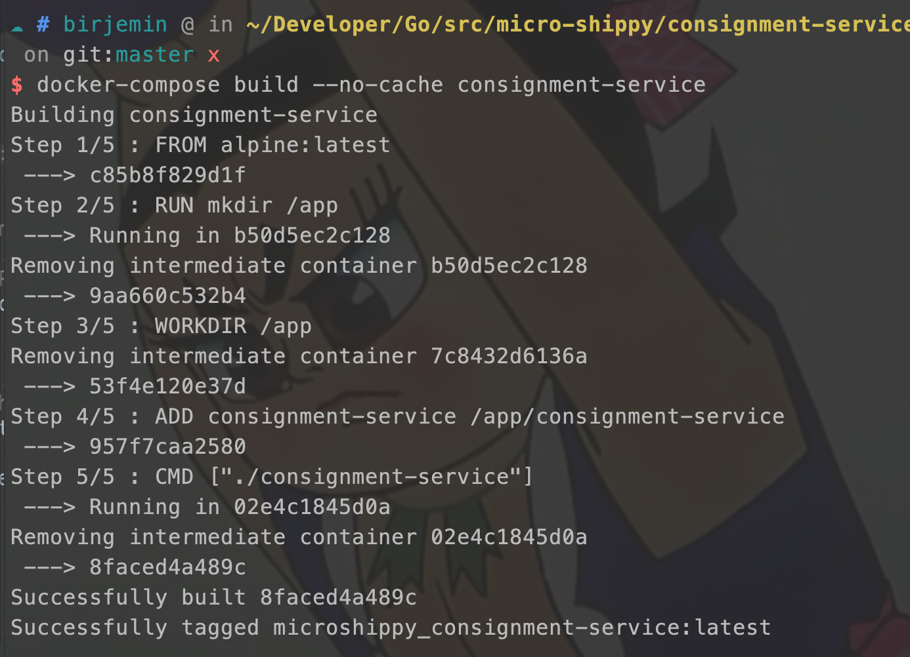
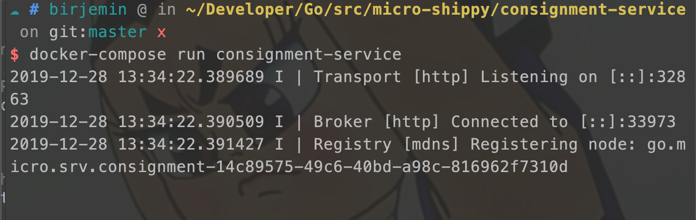
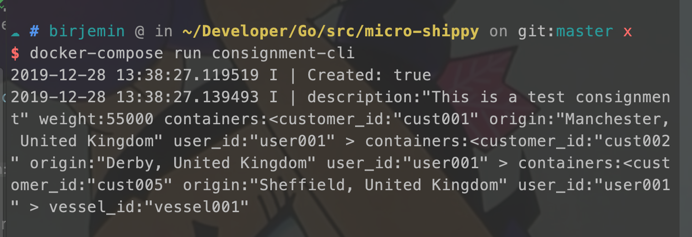
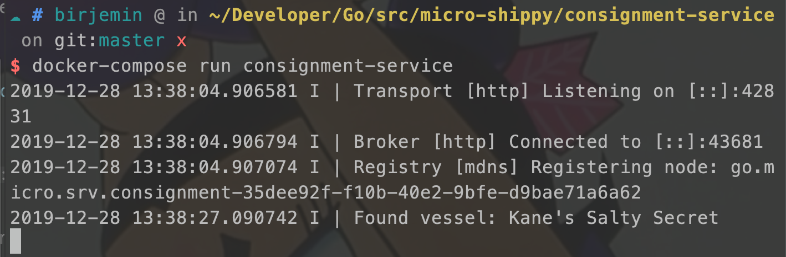
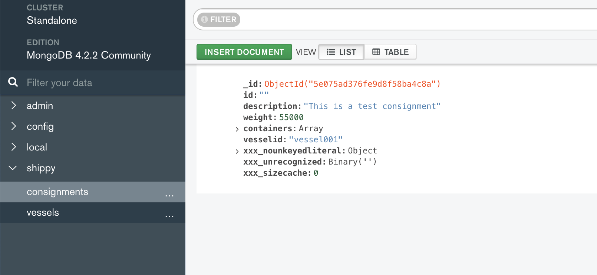

# 第七节：引入MongoDB

## 准备工作
- 什么是[MongoDB](http://birjemin.com/wiki/tech-mongodb)？
- 如何使用MongoDB？
- 什么是[go-mocro服务模板](https://micro.mu/docs/cn/new.html)
    
    生成的模板格式如下：
    ```
    ├── main.go
    ├── plugin.go
    ├── handler
    │   └── example.go
    ├── subscriber
    │   └── example.go
    ├── proto/example
    │   └── example.proto
    ├── Dockerfile
    ├── Makefile
    └── README.md
    ```
    
    可以根据自己的需求更改其结构，比如原博主更改的托运服务目录结构如下图：
    ```
    ├── Dockerfile
    ├── Makefile
    ├── datastore.go
    ├── handler.go
    ├── main.go
    ├── proto
    │   └── consignment
    │       ├── consignment.pb.go
    │       └── consignment.proto
    └── repository.go
    ```

## 开始
引入mongodb的golang库
```
go get gopkg.in/mgo.v2
```

这一节开始代码详情见仓库对应的tag版本。

### 修改consignment-service服务
引入mongoDB保存托运数据，发起托运时，如果货轮服务返回了可用货轮，则创建托运数据，保存到MongoDB中。

#### 增加文件
代码细节见仓库代码，修改的文件：datastore.go、handler.go、repository.go

#### 修改main.go
引入MongoDB连接
```
...

func main() {

    // 从环境变量获取host
    host := os.Getenv("DB_HOST")

    if host == "" {
        host = defaultHost
    }
    // 创建mongodb的连接
    session, err := CreateSession(host)
    defer session.Close()
    if err != nil {
        log.Panicf("Could not connect to datastore with host %s - %v", host, err)
    }

    srv := micro.NewService(
        micro.Name("go.micro.srv.consignment"),
        micro.Version("latest"),
    )

    vesselClient := vesselProto.NewVesselServiceClient("go.micro.srv.vessel", srv.Client())

    srv.Init()

    pb.RegisterShippingServiceHandler(srv.Server(), &service{session, vesselClient})

    if err := srv.Run(); err != nil {
        fmt.Println(err)
    }
}
```

### 修改vessel-service服务
货轮服务启动时，创建货轮的数据，保存到MongoDB中，托运服务通过rpc调用查询是否有可用货轮时，处理相关逻辑，从MongoDB从查找是否存在可用的货轮，并且返回给托运服务。

#### 修改vessel.proto文件
新增一个创建货轮的方法
```
syntax = "proto3";

package vessel;

service VesselService {
    rpc FindAvailable(Specification) returns (Response) {}
    // 增加一个创建货轮的方法
    rpc Create(Vessel) returns (Response) {}
}
...
message Response {
    Vessel vessel = 1;
    repeated Vessel vessels = 2;
    bool created = 3;
}
```

#### 增加文件
代码细节见仓库代码，修改的文件：datastore.go、handler.go、repository.go

#### 修改main.go
和托运服务的`main.go`文件类似，新增了MongoDB的连接。
```
const (
    defaultHost = "localhost:27017"
)
// 测试数据
func createDummyData(repo Repository) {
    defer repo.Close()
    vessels := []*pb.Vessel{
        {Id: "vessel001", Name: "Kane's Salty Secret", MaxWeight: 200000, Capacity: 500},
    }
    for _, v := range vessels {
        repo.Create(v)
    }
}

func main() {

    host := os.Getenv("DB_HOST")

    if host == "" {
        host = defaultHost
    }

    session, err := CreateSession(host)
    defer session.Close()

    if err != nil {
        log.Fatalf("Error connecting to datastore: %v", err)
    }

    repo := &VesselRepository{session.Copy()}
    // 创建一条测试数据！！！！
    createDummyData(repo)

    srv := micro.NewService(
        micro.Name("go.micro.srv.vessel"),
        micro.Version("latest"),
    )

    srv.Init()

    pb.RegisterVesselServiceHandler(srv.Server(), &service{session})

    if err := srv.Run(); err != nil {
        fmt.Println(err)
    }
}
```

### 修改docker-compose.yml
引入mongo镜像，注意这里增加了一个environment参数，容器与容器之间可以通过制定容器名称+端口进行调用。
```
version: '3.1'

services:
  consignment-cli:
    build: ./consignment-cli

  consignment-service:
    build: ./consignment-service
    environment:
      DB_HOST: "datastore:27017"

  vessel-service:
    build: ./vessel-service
    environment:
      DB_HOST: "datastore:27017"

  datastore:
    image: mongo
    ports:
      - "27017:27017"
```

### 测试

datastore窗口
```
docker-compose up --no-start datastore
docker-compose start datastore 
docker-compose ps
```


vessel-service窗口：

```
make build
docker-compose build --no-cache vessel-service 
docker-compose run vessel-service 
```




此时MongoDB中会生成一条数据（代码中创建了一条测试数据，货船数据）：


consignment-service窗口：

```
make build
docker-compose build --no-cache consignment-service 
docker-compose run consignment-service 
```





consignment-cli窗口：
```
docker-compose run consignment-cli 
```


consignment-service窗口变化：



此时MongoDB中会生成一条数据（货运数据）：



### 当前的文件目录
```
$GOPATH/src
    └── micro-shippy
        ├── README.md
        ├── consignment-cli
        │   ├── Dockerfile
        │   ├── Makefile
        │   ├── cli.go
        │   ├── consignment-cli
        │   └── consignment.json
        ├── consignment-service
        │   ├── Dockerfile
        │   ├── Makefile
        │   ├── consignment-service
        │   ├── datastore.go
        │   ├── handler.go
        │   ├── main.go
        │   ├── proto
        │   │   └── consignment
        │   │       ├── consignment.pb.go
        │   │       └── consignment.proto
        │   └── repository.go
        ├── docker-compose.yml
        ├── go.mod
        ├── go.sum
        └── vessel-service
            ├── Dockerfile
            ├── Makefile
            ├── datastore.go
            ├── handler.go
            ├── main.go
            ├── proto
            │   └── vessel
            │       ├── vessel.pb.go
            │       └── vessel.proto
            ├── repository.go
            └── vessel-service

```