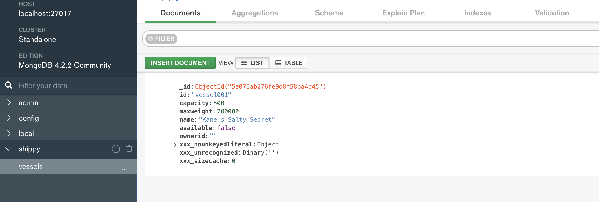
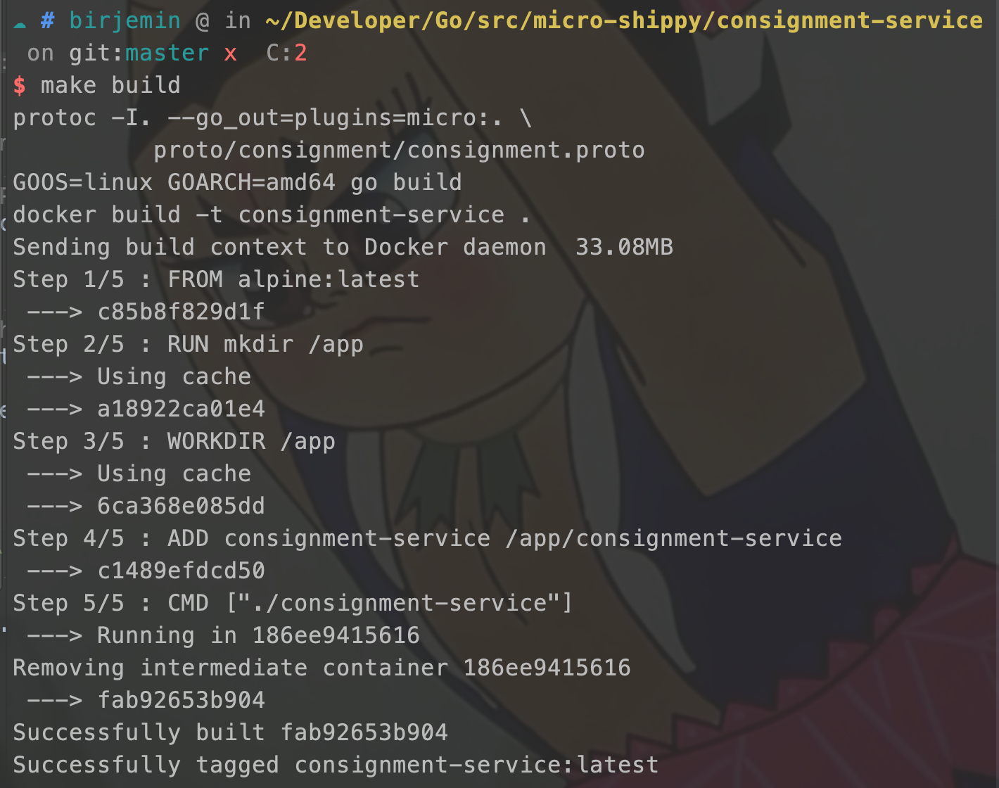

## 第七部分：引入MongoDB

### 开始

```
go get gopkg.in/mgo.v2
```

#### 修改consignment-service服务

##### 增加文件
datastore.go、handler.go、repository.go

##### 修改main.go

```
...

func main() {

    // Database host from the environment variables
    host := os.Getenv("DB_HOST")

    if host == "" {
        host = defaultHost
    }

    session, err := CreateSession(host)

    // Mgo creates a 'master' session, we need to end that session
    // before the main function closes.
    defer session.Close()

    if err != nil {

        // We're wrapping the error returned from our CreateSession
        // here to add some context to the error.
        log.Panicf("Could not connect to datastore with host %s - %v", host, err)
    }

    // Create a new service. Optionally include some options here.
    srv := micro.NewService(
        // This name must match the package name given in your protobuf definition
        micro.Name("go.micro.srv.consignment"),
        micro.Version("latest"),
    )

    vesselClient := vesselProto.NewVesselServiceClient("go.micro.srv.vessel", srv.Client())

    // Init will parse the command line flags.
    srv.Init()

    // Register handler
    pb.RegisterShippingServiceHandler(srv.Server(), &service{session, vesselClient})

    // Run the server
    if err := srv.Run(); err != nil {
        fmt.Println(err)
    }
}
```

#### 修改vessel-service服务

##### 修改vessel.proto文件
```
syntax = "proto3";

package vessel;

service VesselService {
    rpc FindAvailable(Specification) returns (Response) {}
    // 增加一个创建货轮的方法
    rpc Create(Vessel) returns (Response) {}
}
...
message Response {
    Vessel vessel = 1;
    repeated Vessel vessels = 2;
    bool created = 3;
}
```

##### 增加文件
datastore.go、handler.go、repository.go

##### 修改main.go
```
const (
    defaultHost = "localhost:27017"
)

func createDummyData(repo Repository) {
    defer repo.Close()
    vessels := []*pb.Vessel{
        {Id: "vessel001", Name: "Kane's Salty Secret", MaxWeight: 200000, Capacity: 500},
    }
    for _, v := range vessels {
        repo.Create(v)
    }
}

func main() {

    host := os.Getenv("DB_HOST")

    if host == "" {
        host = defaultHost
    }

    session, err := CreateSession(host)
    defer session.Close()

    if err != nil {
        log.Fatalf("Error connecting to datastore: %v", err)
    }

    repo := &VesselRepository{session.Copy()}
    // 创建一条测试数据！！！！
    createDummyData(repo)

    srv := micro.NewService(
        micro.Name("go.micro.srv.vessel"),
        micro.Version("latest"),
    )

    srv.Init()

    // Register our implementation with
    pb.RegisterVesselServiceHandler(srv.Server(), &service{session})

    if err := srv.Run(); err != nil {
        fmt.Println(err)
    }
}
```

#### 修改docker-compose.yml
```
version: '3.1'

services:
  consignment-cli:
    build: ./consignment-cli

  consignment-service:
    build: ./consignment-service
    environment:
      DB_HOST: "datastore:27017"

  vessel-service:
    build: ./vessel-service
    environment:
      DB_HOST: "datastore:27017"

  datastore:
    image: mongo
    ports:
      - "27017:27017"
```


#### 测试

datastore窗口
```
docker-compose up --no-start datastore
docker-compose start datastore 
docker-compose ps
```


vessel-service窗口：

```
make build
docker-compose build --no-cache vessel-service 
docker-compose run vessel-service 
```


此时MongoDB中会生成一条数据（代码中创建了一条测试数据，货船数据）：


consignment-service窗口：

```
make build
docker-compose build --no-cache consignment-service 
docker-compose run consignment-service 
```



consignment-cli窗口：
```
docker-compose run consignment-cli 
```


consignment-service窗口变化：


此时MongoDB中会生成一条数据（货运数据）：


#### 当前的文件目录
```
$GOPATH/src
    └── micro-shippy
        ├── README.md
        ├── consignment-cli
        │   ├── Dockerfile
        │   ├── Makefile
        │   ├── cli.go
        │   ├── consignment-cli
        │   └── consignment.json
        ├── consignment-service
        │   ├── Dockerfile
        │   ├── Makefile
        │   ├── consignment-service
        │   ├── datastore.go
        │   ├── handler.go
        │   ├── main.go
        │   ├── proto
        │   │   └── consignment
        │   │       ├── consignment.pb.go
        │   │       └── consignment.proto
        │   └── repository.go
        ├── docker-compose.yml
        ├── go.mod
        ├── go.sum
        └── vessel-service
            ├── Dockerfile
            ├── Makefile
            ├── datastore.go
            ├── handler.go
            ├── main.go
            ├── proto
            │   └── vessel
            │       ├── vessel.pb.go
            │       └── vessel.proto
            ├── repository.go
            └── vessel-service

```