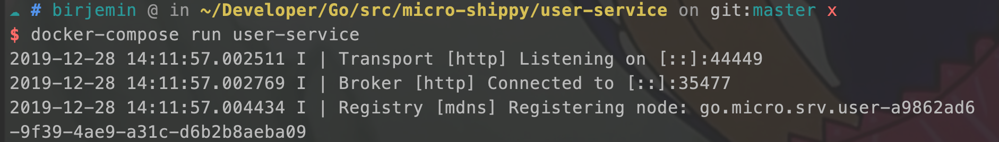

# 第八节：引入user服务和Postgres

## 准备工作
- 什么是[Postgres](https://www.postgresql.org/)?

## 开始
引入database的golang库
```
go get github.com/jinzhu/gorm
```

### 增加user-service服务
上一节中，已经实现托运服务和货轮服务之间的调用，并且还将托运数据、货轮数据保存到了MongoDB中，这一节开始增加用户服务，将数据保存到Postgres数据库中，并且在以后实现jwt鉴权。

#### 增加protobuf通信协议
```
syntax = "proto3";

package user;
// 提供用户的增加、查询、获取全部用户、授权、鉴权方法
service UserService {
    rpc Create(User) returns (Response) {}
    rpc Get(User) returns (Response) {}
    rpc GetAll(Request) returns (Response) {}
    rpc Auth(User) returns (Token) {}
    rpc ValidateToken(Token) returns (Token) {}
}

message User {
    string id = 1;
    string name = 2;
    string company = 3;
    string email = 4;
    string password = 5;
}

message Request {}

message Response {
    User user = 1;
    repeated User users = 2;
    repeated Error errors = 3;
}

message Token {
    string token = 1;
    bool valid = 2;
    repeated Error errors = 3;
}

message Error {
    int32 code = 1;
    string description = 2;
}
```
#### main.go文件
```
package main

import (
    "fmt"
    pb "github.com/birjemin/micro-shippy/user-service/proto/user"
    "github.com/micro/go-micro"
    "log"
)

func main() {
    // 创建db连接
    db, err := CreateConnection()
    defer db.Close()
    if err != nil {
        log.Fatalf("Could not connect to DB: %v", err)
    }

    // 自动创建表单
    db.AutoMigrate(&pb.User{})

    repo := &UserRepository{db}
    // 授权、鉴权使用到，暂时没用到
    tokenService := &TokenService{repo}

    srv := micro.NewService(
        micro.Name("go.micro.srv.user"),
        micro.Version("latest"),
    )

    srv.Init()

    pb.RegisterUserServiceHandler(srv.Server(), &service{repo, tokenService})

    if err := srv.Run(); err != nil {
        fmt.Println(err)
    }
}

```
#### 其他文件
详情见仓库，database.go、extension.go、handler.go...

### 增加user-cli访问终端
忽略代码，因为第七节没有相关的逻辑。

### 修改docker-compose.yml
注意查看用户服务设置了环境变量，便于建立数据库连接。
```
version: '3.1'

services:
  consignment-cli:
    build: ./consignment-cli

  user-cli:
    build: ./user-cli

  consignment-service:
    build: ./consignment-service
    environment:
      DB_HOST: "datastore:27017"

  vessel-service:
    build: ./vessel-service
    environment:
      DB_HOST: "datastore:27017"

  user-service:
    build: ./user-service
    environment:
      DB_NAME: "postgres"
      DB_HOST: "database"
      DB_PORT: "5432"
      DB_USER: "postgres"
      DB_PASSWORD: "postgres"

  datastore:
    image: mongo
    ports:
      - "27017:27017"

  database:
    image: postgres
    ports:
      - "5432:5432"
```

### 测试

database窗口
```
docker-compose ps
```


user-cli窗口：

```
make build
docker-compose build --no-cache user-cli 
docker-compose run user-cli 
```


user-service窗口：

```
make build
docker-compose build --no-cache user-service 
docker-compose run user-service 
```


此时Postgres中会生成一条数据（用户数据）：


### 当前的文件目录
```
$GOPATH/src
    └── micro-shippy
        ├── README.md
        ├── consignment-cli
        │   ├── Dockerfile
        │   ├── Makefile
        │   ├── cli.go
        │   ├── consignment-cli
        │   └── consignment.json
        ├── consignment-service
        │   ├── Dockerfile
        │   ├── Makefile
        │   ├── consignment-service
        │   ├── datastore.go
        │   ├── handler.go
        │   ├── main.go
        │   ├── proto
        │   │   └── consignment
        │   │       ├── consignment.pb.go
        │   │       └── consignment.proto
        │   └── repository.go
        ├── docker-compose.yml
        ├── go.mod
        ├── go.sum
        ├── user-cli
        │   ├── Dockerfile
        │   ├── Makefile
        │   ├── cli.go
        │   └── user-cli
        ├── user-service
        │   ├── Dockerfile
        │   ├── Makefile
        │   ├── database.go
        │   ├── handler.go
        │   ├── main.go
        │   ├── proto
        │   │   └── user
        │   │       ├── extension.go
        │   │       ├── user.pb.go
        │   │       └── user.proto
        │   ├── repository.go
        │   ├── token_service.go
        │   └── user-service
        └── vessel-service
            ├── Dockerfile
            ├── Makefile
            ├── datastore.go
            ├── handler.go
            ├── main.go
            ├── proto
            │   └── vessel
            │       ├── vessel.pb.go
            │       └── vessel.proto
            ├── repository.go
            └── vessel-service


```