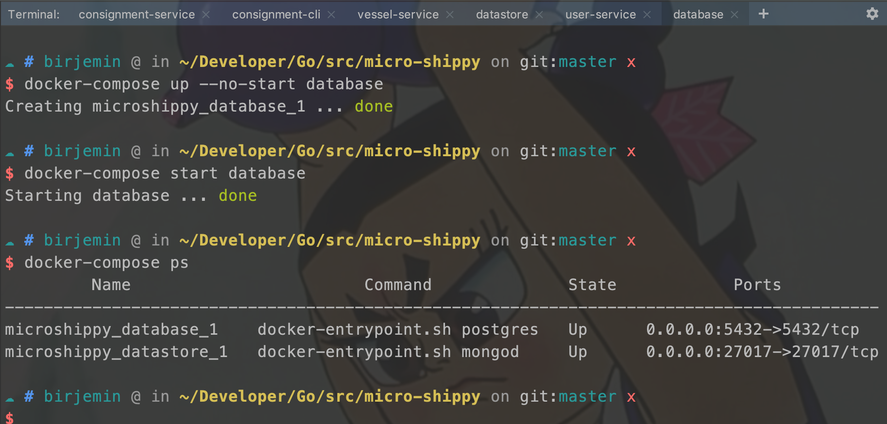
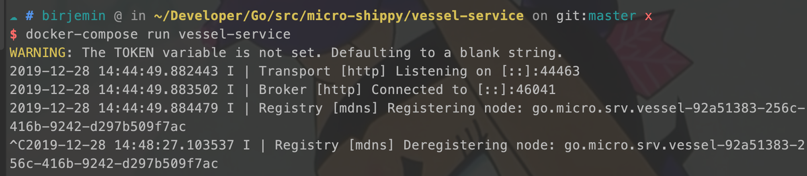
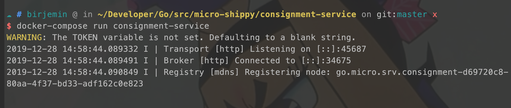
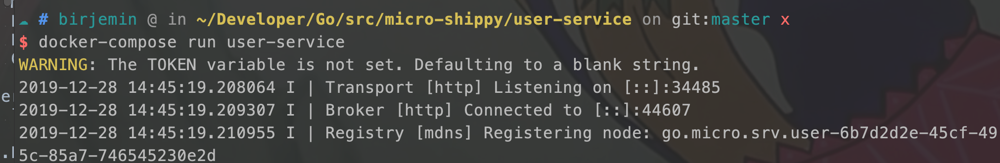
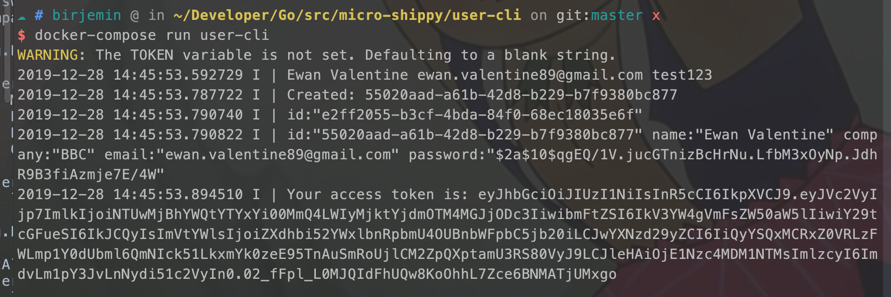
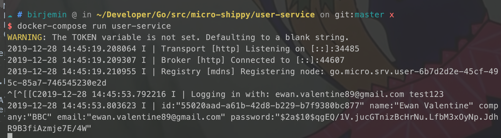
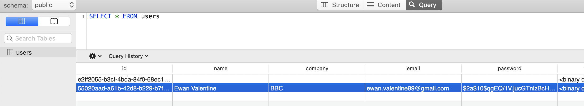
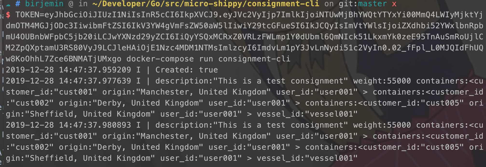
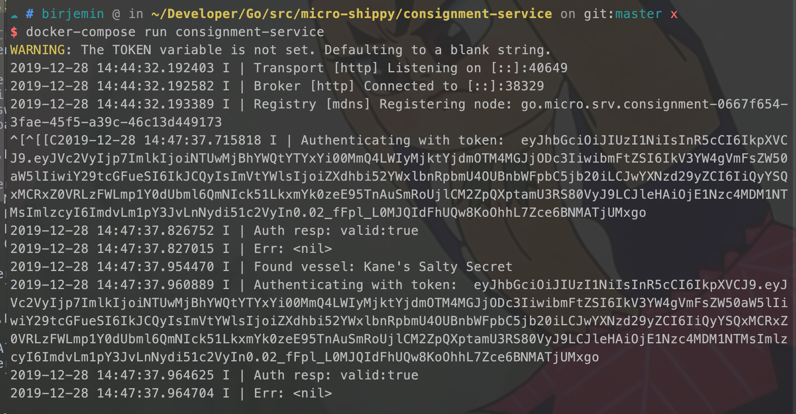
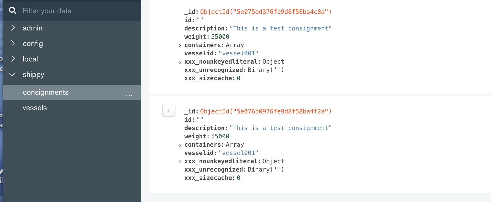

## 第九部分：引入jwt鉴权

### 开始

```
go get github.com/dgrijalva/jwt-go
```

#### user-service服务

##### 修改handler.go
```
...
func (srv *service) Auth(ctx context.Context, req *pb.User, res *pb.Token) error {
    log.Println("Logging in with:", req.Email, req.Password)
    user, err := srv.repo.GetByEmail(req.Email)
    log.Println(user)
    if err != nil {
        return err
    }

    // Compares our given password against the hashed password
    // stored in the database
    if err := bcrypt.CompareHashAndPassword([]byte(user.Password), []byte(req.Password)); err != nil {
        return err
    }

    token, err := srv.tokenService.Encode(user)
    if err != nil {
        return err
    }
    res.Token = token
    return nil
}
...
func (srv *service) ValidateToken(ctx context.Context, req *pb.Token, res *pb.Token) error {

    if req.Token == "" {
        return errors.New("token invalid")
    }
    // Decode token
    claims, err := srv.tokenService.Decode(req.Token)
    if err != nil {
        return err
    }

    log.Println(claims)

    if claims.User.Id == "" {
        return errors.New("invalid user")
    }

    res.Valid = true

    return nil
}
```

##### 修改repository.go文件
```
...
func (repo *UserRepository) GetByEmail(email string) (*pb.User, error) {
    user := &pb.User{}
    if err := repo.db.Where("email = ?", email).
        First(&user).Error; err != nil {
        return nil, err
    }
    return user, nil
}
...
```

##### 修改token_service.go文件
```
...
```

#### 修改user-cli访问终端
##### 修改cli.go
```
...
```

#### 修改consignment-service
##### 修改main.go
```
...

func AuthWrapper(fn server.HandlerFunc) server.HandlerFunc {
    return func(ctx context.Context, req server.Request, resp interface{}) error {
        meta, ok := metadata.FromContext(ctx)
        if !ok {
            return errors.New("no auth meta-data found in request")
        }
        token := meta["Token"]
        log.Println("Authenticating with token: ", token)

        // Auth here
        authClient := userService.NewUserServiceClient("go.micro.srv.user", client.DefaultClient)
        authResp, err := authClient.ValidateToken(ctx, &userService.Token{
            Token: token,
        })
        log.Println("Auth resp:", authResp)
        log.Println("Err:", err)
        if err != nil {
            return err
        }

        err = fn(ctx, req, resp)
        return err
    }
}
```

#### 修改consignment-cli
##### 修改cli.go
```
...

    ctx := metadata.NewContext(context.Background(), map[string]string{
        "token": token,
    })

    r, err := client.CreateConsignment(ctx, consignment)
    if err != nil {
        log.Fatalf("Could not create: %v", err)
    }
    log.Printf("Created: %t", r.Created)

    getAll, err := client.GetConsignments(ctx, &pb.GetRequest{})
    if err != nil {
        log.Fatalf("Could not list consignments: %v", err)
    }
    for _, v := range getAll.Consignments {
        log.Println(v)
    }
...
```

#### 测试

database窗口
```
docker-compose ps
```


vessel-service开启：

```
docker-compose run vessel-service 
```


consignment-service窗口：

```
make build
docker-compose build --no-cache consignment-service 
docker-compose run consignment-service 
```


user-service窗口：

```
make build
docker-compose build --no-cache user-service 
docker-compose run user-service 
```


user-cli窗口：

```
make build
docker-compose build --no-cache user-cli 
docker-compose run user-cli 
```

得到TOKEN的值！！

此时user-service窗口：


Postgres数据新增一条：


consignment-cli窗口：

```
TOKEN=xxx docker-compose run user-service 
```


此时consignment-service窗口变化：


此时MongoDB中会生成一条数据（货运数据）：


#### 当前的文件目录
```
$GOPATH/src
    └── micro-shippy
        ├── README.md
        ├── consignment-cli
        │   ├── Dockerfile
        │   ├── Makefile
        │   ├── cli.go
        │   ├── consignment-cli
        │   └── consignment.json
        ├── consignment-service
        │   ├── Dockerfile
        │   ├── Makefile
        │   ├── consignment-service
        │   ├── datastore.go
        │   ├── handler.go
        │   ├── main.go
        │   ├── proto
        │   │   └── consignment
        │   │       ├── consignment.pb.go
        │   │       └── consignment.proto
        │   └── repository.go
        ├── docker-compose.yml
        ├── go.mod
        ├── go.sum
        ├── user-cli
        │   ├── Dockerfile
        │   ├── Makefile
        │   ├── cli.go
        │   └── user-cli
        ├── user-service
        │   ├── Dockerfile
        │   ├── Makefile
        │   ├── database.go
        │   ├── handler.go
        │   ├── main.go
        │   ├── proto
        │   │   └── user
        │   │       ├── extension.go
        │   │       ├── user.pb.go
        │   │       └── user.proto
        │   ├── repository.go
        │   ├── token_service.go
        │   └── user-service
        └── vessel-service
            ├── Dockerfile
            ├── Makefile
            ├── datastore.go
            ├── handler.go
            ├── main.go
            ├── proto
            │   └── vessel
            │       ├── vessel.pb.go
            │       └── vessel.proto
            ├── repository.go
            └── vessel-service


```